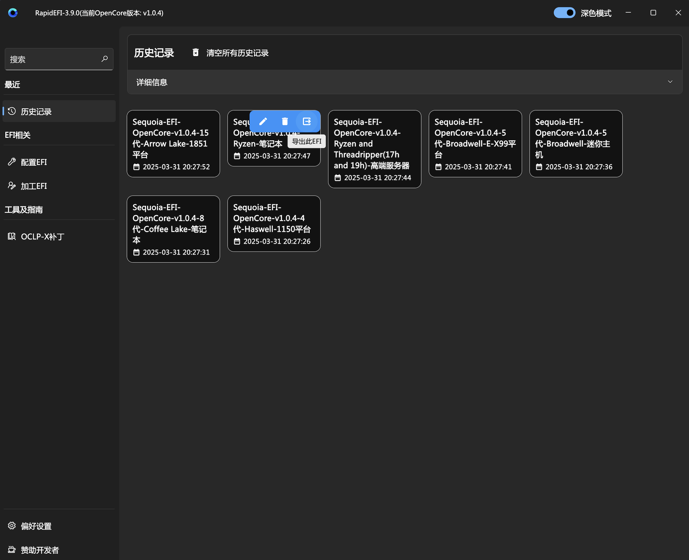
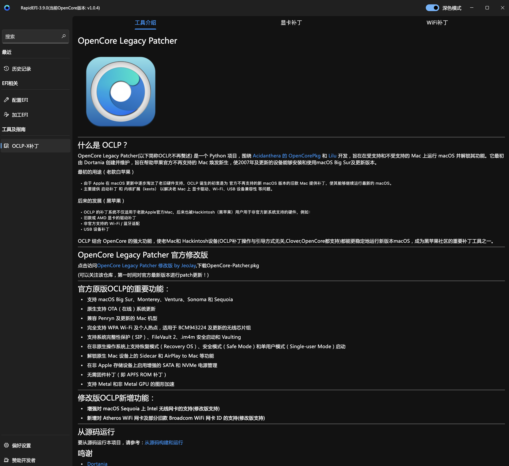
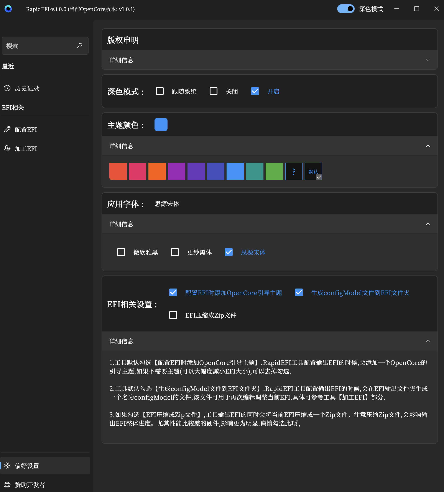

## 重要说明:由于版权原因,目前已删除NootedRed.kext,NootRX.kext驱动!!!

如果需要相关帮助,具体可以参考[帮助说明](https://github.com/JeoJay127/RapidEFI-Tool/blob/main/帮助说明.md)

## 目录

- [前言](#前言)

- [1.RapidEFI是什么?](#1rapidefi是什么)

- [2.RapidEFI软件预览](#2rapidefi软件预览)

- [3.RapidEFI有啥优势或特点?](#3rapidefi有啥优势或特点)

- [4.RapidEFI适合人群](#4rapidefi适合人群)

- [5.RapidEFI软件兼容性?](#5rapidefi-软件兼容性)

- [6.RapidEFI制作的EFI支持哪些macOS版本？](#6rapidefi制作的efi支持哪些macos版本)

- [7.RapidEFI具体支持哪些电脑配置?](#7rapidefi具体支持哪些电脑配置)

- [8.我的电脑是3代以下如何配置?](#8我的电脑是3代以下如何配置)

- [9.RapidEFI配置的EFI是否完美？](#9rapidefi配置的efi是否完美)

- [10.请开发者喝杯奶茶](#10请开发者喝杯奶茶)

- [11.打赏列表(目前仅展示部分，不定期更新)](#11打赏列表目前仅展示部分不定期更新)

- [12.致谢](#12致谢)

## 前言

随着苹果全面转向自研芯片，黑苹果的未来正变得越来越渺茫，投入时间研究和优化 EFI 的人也越来越少。但即便如此，仍然有一群热爱折腾、享受挑战的人，希望继续在 macOS 的世界里探索前行。

**正是这种信念，促使我开发了 RapidEFI** :  **一款完全免费、永久免费的 OpenCore 一键配置工具** ，让黑苹果玩家告别繁琐的手动调试，**真正做到“低门槛上手，高效配置，畅享 macOS”**。

但说实话，开发这样一款工具，远比想象中繁琐复杂。
 适配不同硬件、调试 EFI 配置、跟进 OpenCore 更新、修复各种兼容性问题……每一个环节都充满挑战。不同主板、显卡、CPU 各有差异，EFI 需要精细优化，每一次调整都可能影响整体稳定性。为了解决这些问题，我不断测试、修改代码，甚至花费大量时间调试，只为让更多人能够顺利启动 macOS，让黑苹果的体验更加丝滑稳定。

RapidEFI 的目标很简单：**让黑苹果玩家省去繁琐的手动调试，让每一个热爱折腾的人，都能快速体验 macOS 的流畅与优雅**。

在这个逐渐冷却的领域里，我很幸运，遇到了许多仍然默默支持 RapidEFI 的朋友。你们的每一份捐赠、每一句鼓励，甚至是一次简单的使用反馈，都让我深受感动。**特别是那些匿名捐赠的朋友，或许你的名字从未出现，但你的支持，我一直记在心里。**

黑苹果的时代或许终将落幕，但**折腾的精神不会消失**。
 如果 RapidEFI 曾帮助过你，希望你能继续支持它，让这份坚持走得更远，让这段旅程的最后时光依然精彩。

**感谢每一个仍在坚持的人，感谢每一个仍然热爱的你！❤️**

## 1.RapidEFI是什么？

RapidEFI是一款黑苹果OpenCore一键配置工具,3秒即可制作基于OpenCore最新版本的黑苹果EFI，由作者本人(JeoJay,B站同名)业余时间开发。RapidEFI **用爱发电,完全免费,永久免费**！！！有兴趣的可以[观看B站视频](https://www.bilibili.com/video/BV1Li421h7FZ)

## 2.RapidEFI软件预览

历史记录

OCLP-X 补丁

偏好设置

带一个主题

## 3.RapidEFI有啥优势或特点？

RapidEFI一键配置工具，参考了[OpenCore官方指南](https:/dortania.github.io/OpenCore-Install-Guide/),代替了手动收集文件和手工配置的繁琐过程，极大节省了配置时间。最快3秒不到即可制作基于OpenCore最新版本的黑苹果EFI

特点：

✅ 仅需简单勾选——无需复杂配置，只需勾选对应选项，即可自动生成适配 EFI

✅ 无需联网——完全离线运行，无需下载额外文件，保障隐私安全(NootedRed.kext,NootRX.kext版权问题除外！！！)

✅ 无任何广告——纯净工具，无额外干扰，专注 EFI 生成

✅ 详尽说明——提供详细选项解释，帮助你理解每个配置的作用，避免盲目修改

✅ 基于官方推荐方案——严格遵循 Dortania OpenCore 指南，确保最佳兼容性

## 4.RapidEFI适合人群?

RapidEFI适合有点黑果基础的人群，至少你要懂得：

1.知道EFI有啥作用，如何替换，如何建立引导

2.知道啥是PE,怎么安装Windows，否则一旦手误，系统丢失，你估计要原地爆炸。。。

3.知道怎么进主板bios,怎么修改必要的BIOS设置项

## 5.RapidEFI 软件兼容性？

### RapidEFI支持

1.Windows版本：支持Windows 10及以上系统(理论上支持Win8，自行测试)

- 注意不支持Win7系统！！！

- 经测试支持Win10，Win11虚拟机

2.Mac版本：支持macOS Mojave 10.14及以上系统 

- 需要显卡支持metal

- 一般来说不支持mac虚拟机(因为显卡不支持metal)

3.Linux等其他版本基本很少需要，费事费力，暂时不发了，理解万岁！

## 6.RapidEFI制作的EFI支持哪些macOS版本？

通常支持macOS 10.11.x ~ macOS Tahoe 26.x (注意保持软件最新版本),制作的EFI是向下兼容的 ,可以自行折腾

## 7.RapidEFI具体支持哪些电脑配置?

#### 支持平台一览表：

|       | 台式机(Desktop)                     |       笔记本(Laptop)        |        迷你(Nuc)主机        |        高端服务器(HEDT)        |
| :---: | ----------------------------------- | :-------------------------: | :-------------------------: | :----------------------------: |
| Intel | 4 ~ 15代                            | 4 ~ 10代 (11代以上核显无解) | 4 ~ 10代 (11代以上核显无解) |    4~10代（X99,X299,X599）     |
|  AMD  | Ryzen and Threadripper(17h and 19h) |  Ryzen系列  |  Ryzen系列  | Ryzen Threadripper(线程撕裂者) |

## 8.我的电脑是3代以下如何配置?

具体可以参考[关于Pro](https://github.com/JeoJay127/RapidEFI-Tool/blob/main/关于Pro.md)栏目

## 9.RapidEFI配置的EFI是否完美？

RapidEFI主要是根据官方OC指南制作的一款代替手动配置的工具而已，它很优秀，但它不是神！可以说没有人一开始就配置EFI就完美的，都是一步步完善的。如果你说有，我也不反驳，你自己多体会，多用用黑果吧。此外，黑苹果没有完美一说，它终究是黑果，只有接近完美之说！如果你坚持追求完美，那么请直接上白果！

## 10.请开发者喝杯奶茶

如果有幸帮到了你，可以随意对开发者打赏！感谢支持！！！

 

## 11.打赏列表(目前仅展示部分，不定期更新)

备注：有些打赏没有留下任何信息的大侠，在此一并感谢！！！

|             昵称              | 支付宝 | 微信 |  QQ  |
| :---------------------------: | :----: | :--: | :--: |
|      物语(QQ：51xxxxx25)      |        |  15  |      |
|       ^(QQ:10xxxxxx36)        |        |      |  30  |
|      笑笑(QQ：31xxxxx45)      |        |  15  |      |
|      pkg(QQ：13xxxxxx77)      |   50   |  50  |      |
|   esjjflzh(QQ：34xxxxxx74)    |        |  15  |      |
|      宋yx(QQ:22xxxxxx59)      |        |  20  |      |
|     知行难(QQ:21xxxxx87)      |        |  15  |      |
|  望眼已是浮云(QQ:25xxxxx36)   |        |  15  |      |
|      米浴(QQ:11xxxxx20)       |        |      |  15  |
|   此乃神人也(QQ:12xxxxx15)    |        |  20  |      |
|    金戈&铁马(QQ:13xxxxx34)    |        |  15  |      |
|    Kingying(QQ:47xxxxx44)     |        |  20  |      |
|   Sweeney Jin(QQ:75xxxxx53)   |        |  15  |      |
| 🎸吉他佬文森特🎸(QQ:36xxxxxx96) |        |  20  |      |
|   DG幸福数码(QQ:30xxxxx35)    |        |  20  |      |
|    汉武雄风(QQ:23xxxxx92)     |        |  15  |      |
|    Mr_Prince(QQ:71xxxxx92)    |        |  50  |      |
|    艺声之灵(QQ:29xxxxxx34)    |        | 150  |      |
|   很久很久前(QQ:11xxxxxx83)   |        |  30  |      |
|    麦兜兜（QQ:31xxxxx74）     |        |  15  |      |
|    方波不方(QQ:27xxxxx96)     |        |  15  |      |
|   壶子里的油(QQ:94xxxxx14)    |        |      |  20  |

## 12.致谢

- [Acidanthera](https://github.com/Acidanthera)

  - OpenCorePkg, as well as many of the core kexts and tools

- [AMD-OSX](https://github.com/AMD-OSX/AMD_Vanilla)

  - Patches across 15h, 16h, 17h, and 19h

- [zxystd](https://github.com/zxystd)

  - Intel Wi-Fi Adapter Kernel Extension for macOS

- RapidEFI QQ群 -白给大师老18

  - 提供的12代及以上平台MacPro7,1机型睿频驱动

  - RapidEFI建议及Bug反馈

  

  

  

  

  

  

  

  

  

  

  

  
