## RapidEFI-v1.3.0 (基于OpenCore-v0.9.8)使用说明

## RapidEFI软件预览

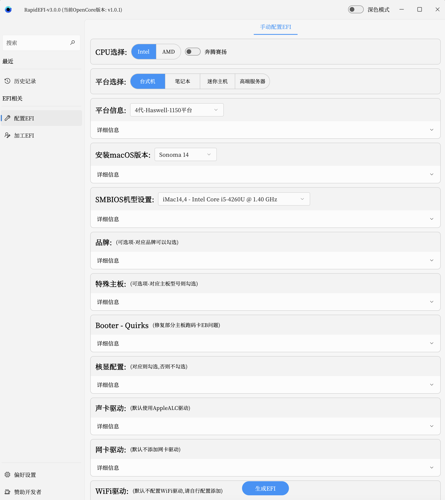

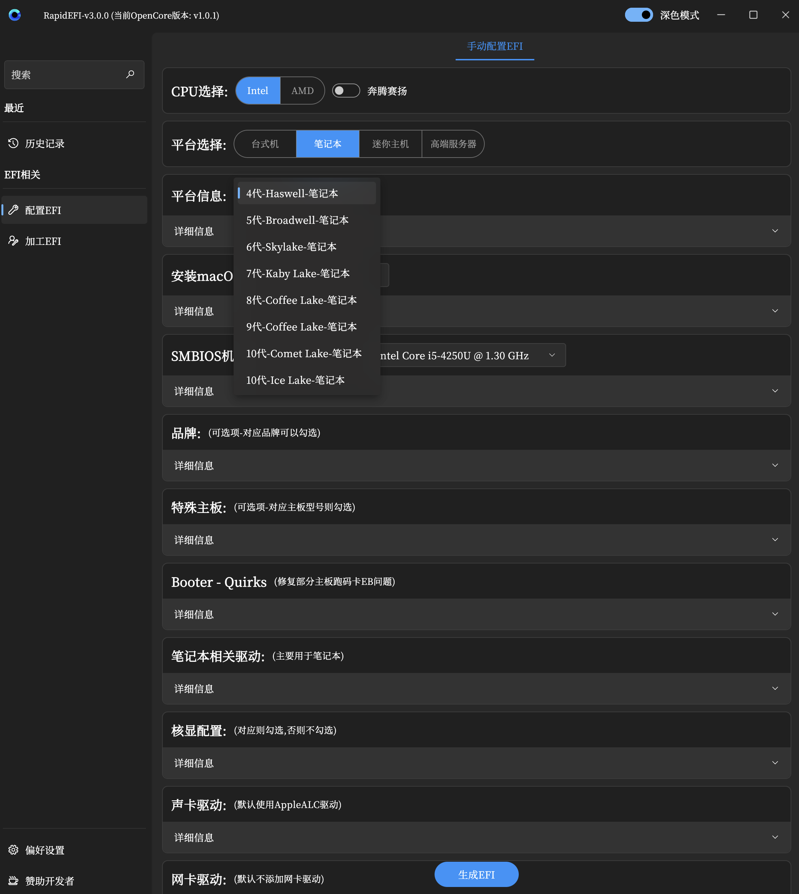

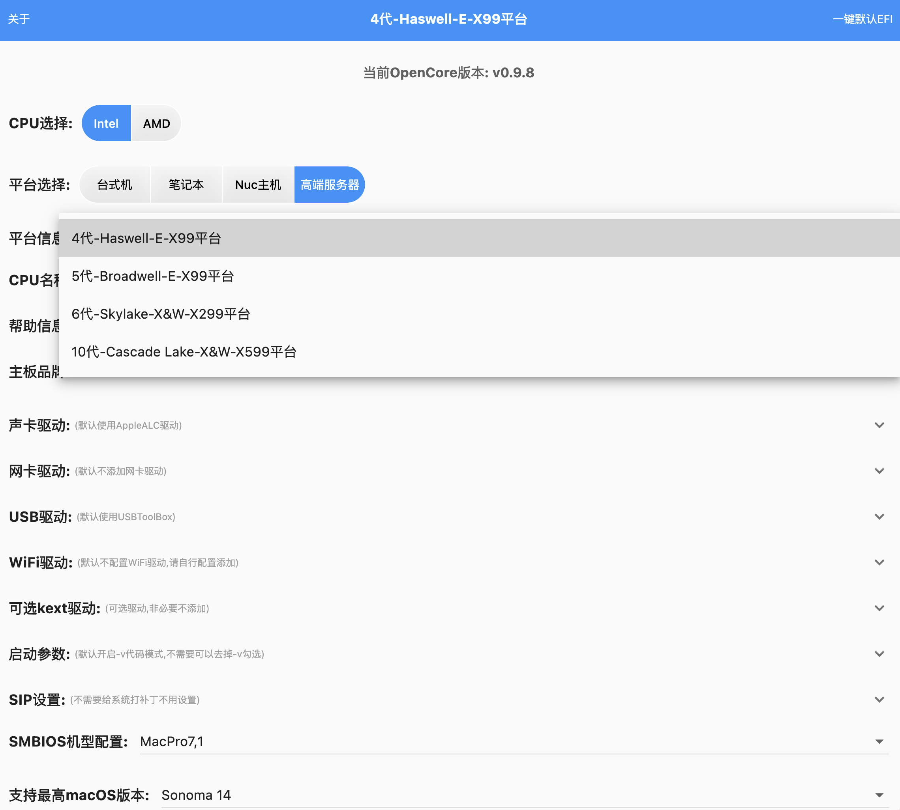

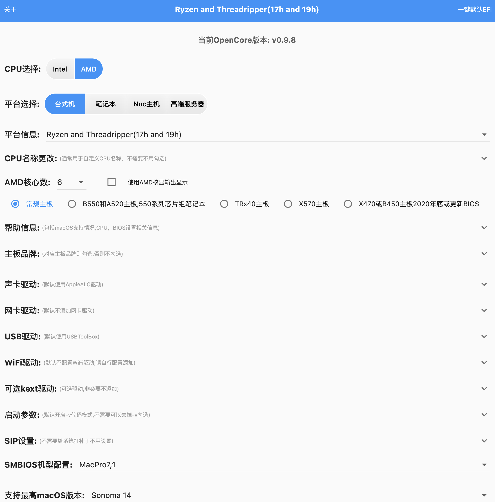

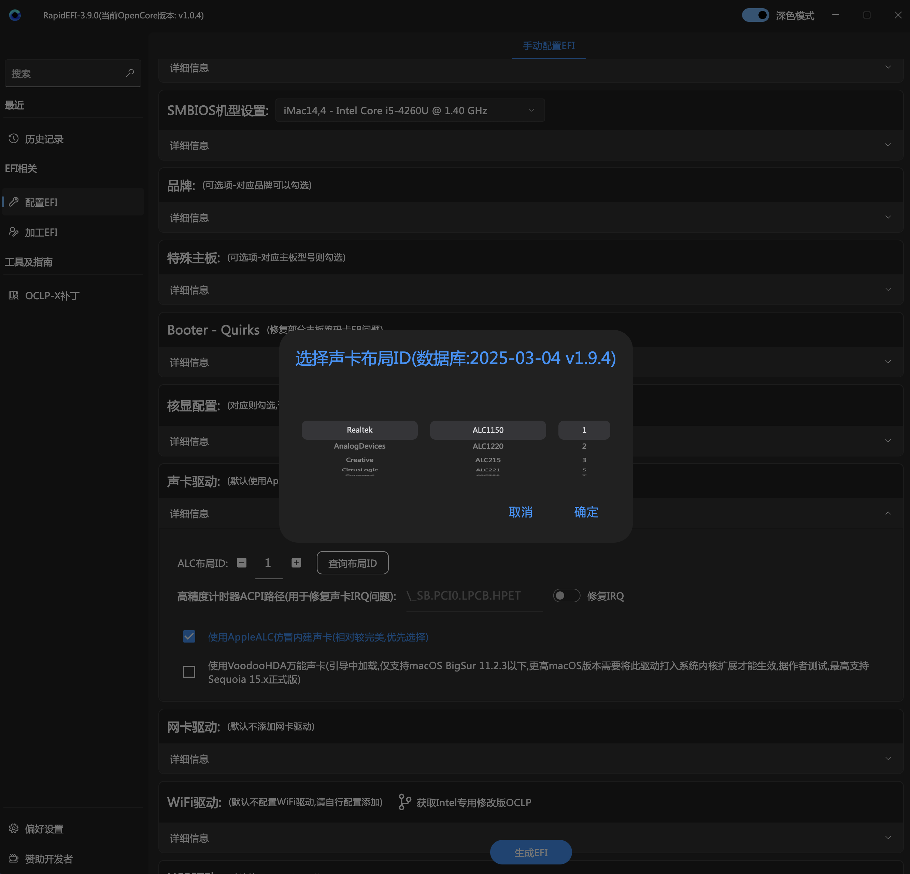

## 带一个主题

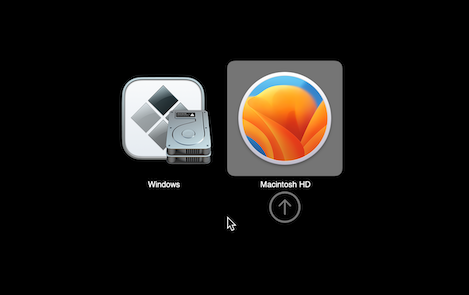

## 1.RapidEFI是什么？

RapidEFI是一款黑苹果OpenCore一键配置工具，10秒即可制作基于OpenCore最新版本的黑苹果EFI，由作者本人(JeoJay,B站同名)业余时间开发。RapidEFI用爱发电,完全免费,永久免费！！！有兴趣的可以[观看B站视频](https://www.bilibili.com/video/BV1DK411t7nB/?spm_id_from=333.337.search-card.all.click)

## 2.RapidEFI有啥优势或特点？

RapidEFI一键配置工具，参考了[OpenCore官方指南](https://dortania.github.io/OpenCore-Install-Guide/),代替了手动收集文件和手工配置的繁琐过程，极大节省了配置时间。最快10秒不到即可制作基于OpenCore最新版本(截止目前为OpenCore-v0.9.8)的黑苹果EFI

## 3.RapidEFI 软件兼容性？

#### RapidEFI 支持：
1.Windows版本：支持Windows 10及以上系统(理论上支持Win8，自行测试),注意不支持Win7系统！！！

2.Mac版本：支持macOS Mojave 10.14及以上系统

3.Linux等其他版本基本很少需要，费事费力，暂时不发了，理解万岁！

## 4.RapidEFI制作的EFI支持哪些macOS版本？

通常支持macOS 10.11.x ~ macOS Sonoma 14.x,制作的EFI是向下兼容的 ,可以自行折腾

## 5.RapidEFI适合人群

RapidEFI适合有点黑果基础的人群，至少你要懂得：

1.知道EFI有啥作用，如何替换，如何建立引导

2.知道啥是PE,怎么安装Windows，否则一旦手误，系统丢失，你估计要原地爆炸。。。

3.知道怎么进主板bios,怎么修改必要的BIOS设置项

## 6.RapidEFI使用正确姿势

如果你打算使用该工具配置EFI，你需要做好基础准备：

#### 1）.请先设置好黑苹果基础BIOS设置(这是前提)

不清楚的可以参考该工具软件【帮助信息】

以四代平台为例：

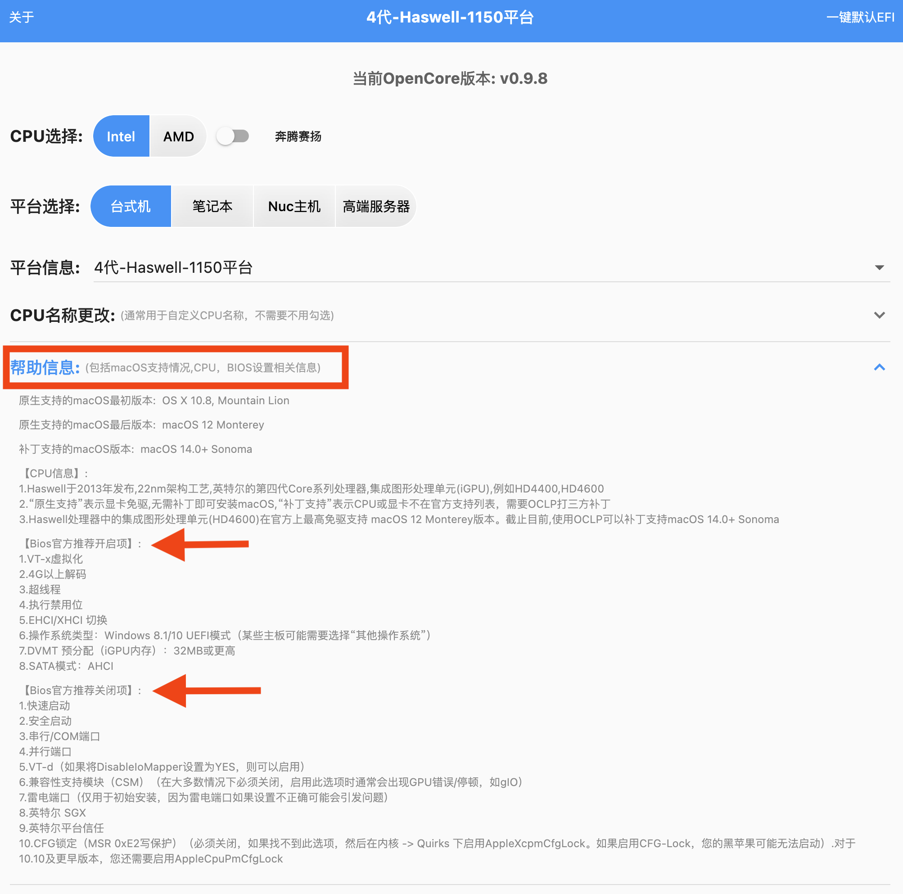

如果BIOS比较简陋，比较通用的BIOS设置是：

【开启项】：

- SATA模式AHCI    

- EHCI/XHCI   

- 4G 以上解码 (没有此选项，可以根据需要添加npci=0x2000引导参数)

- 操作系统类型：选择其他操作系统

【关闭项】：

- 快速/安全启动        

- 兼容性模块CSM

- Re-Size BAR Support (通常位于高级>PCI 子系统. 此项一般存在于新平台2020年之后的bios中) 

- CFGLock关闭是可选的，初始安装你可以不管(config配置默认勾选CFGlock配置了）

  说明：首先这个CFGLock选项只有Intel平台存在，如果有人在AMD平台说卡EB了，叫你去关闭CFGLock，那你可以去揍他了，AMD平台根本就没有CFGLock！

#### 2）.确定你的配置所属平台

软件中以CPU类型和CPU架构为准 

#### 3）.如果你确认使用该工具配置EFI，请始终保持【初步精简，后期完善】原则，可以减少问题！
尤其笔记本，别看见是笔记本可能适用，就添加（随便举个例子，例如:电池读数，自动亮度补丁，亮度快捷键，这些随便一个都有可能卡代码）.如果使用工具生成的EFI出现无法引导，自己按照OC指南可以引导，那可能是工具读取的静态配置文件个别填写错误，对，你没看错，大部分都是提前准备好的静态数据，所以存在手写填错的情况！建议贴平台配置，提issue(报告问题)！当然成功也可以进行反馈！

以下是部分粉丝自行折腾记录(挺佩服的)

  

## 7.RapidEFI配置的EFI是否完美？

RapidEFI主要是根据官方OC指南制作的一款代替手动配置的工具而已，它很优秀，但它不是神！可以说没有人一开始就配置EFI就完美的，都是一步步完善的。如果你说有，我也不反驳，你自己多体会，多用用黑果吧。此外，黑苹果没有完美一说，它终究是黑果，只有接近完美之说！如果你坚持最求完美，那么请直接上白果！

## 8.RapidEFI看到有Pro版本，区别是什么？

普通版本支持平台一览表：

|       | 台式机(Desktop)                     |       笔记本(Laptop)        |        迷你(Nuc)主机        |        高端服务器(HEDT)        |
| :---: | ----------------------------------- | :-------------------------: | :-------------------------: | :----------------------------: |
| Intel | 4 ~ 14代                            | 4 ~ 10代 (11代以上核显无解) | 4 ~ 10代 (11代以上核显无解) |    4~10代（X99,X299,X599）     |
|  AMD  | Ryzen and Threadripper(17h and 19h) |  Ryzen系列(2000~5000核显)   |  Ryzen系列(2000~5000核显)   | Ryzen Threadripper(线程撕裂者) |

Pro版本支持平台一览表：

|       | 台式机(Desktop)                                              |       笔记本(Laptop)        |       迷你(Nuc)主机        |        高端服务器(HEDT)         |
| :---: | ------------------------------------------------------------ | :-------------------------: | :------------------------: | :-----------------------------: |
| Intel | 0 ~ 14代                                                     | 0 ~ 10代 (11代以上核显无解) | 0~ 10代 (11代以上核显无解) | 1~10代（X58,X79,X99,X299,X599） |
|  AMD  | Bulldozer(15h) and Jaguar(16h)  Ryzen and Threadripper(17h and 19h) |          Ryzen系列          |  Ryzen系列(2000~5000核显)  | Ryzen Threadripper(线程撕裂者)  |

备注： 

1.这里0代主要指的是台式机775老平台，笔记本Core 2系列老平台(官方并没有0代说法)

2.Bulldozer(15h) and Jaguar(16h) 主要支持比如FM1，FM2, AM3速龙系列，推土机系列(FX6300,FX8300)

#### RapidEFI普通版和RapidEFI-Pro区别在于：

1.Pro版本支持Intel 0~ 14代全平台,主要就是多了【支持3代及以下老平台】(这个都超过12年了，几乎很少有人使用了)，除此之外目前没啥区别，因此理性对待！

2.Pro版本维护相对麻烦很多，不免费提供(这个需求算是极少了,如果实在需要，可以打赏15进Pro版QQ群，不算过分吧，哈哈哈！算是支持下UP开发了，理解万岁！！！(哪里打赏？普通版RapidEFI工具左上角，点击"关于"就可以看到了。或者下文打赏码！感谢支持！UP联系方式：QQ766264141或者WX:JeoJay127。除此之外没有其他私人联系方式，谨防受骗) 

3.普通版修复Bug为主，更新内容可能会相对缓慢，Pro版本会一直更新下去，有啥新功能会在Pro版QQ群优先说明

#### Pro版本计划安排：

|                    计划安排                     | 当前进度       | 完成日期      |
| :---------------------------------------------: | -------------- | ------------- |
|             0代～14代所有Intel平台              | 已完成         | 2024.1.19     |
| Bulldozer(15h) and Jaguar(16h) ，支持速龙老平台 | 已完成         | 2024.2.4      |
|        识别本机电脑硬件信息，自动配置EFI        | 正处于开发期 | 预估2月中下旬 |
|               Clover一键转OC引导                | 待开发             | 预计2024.3    |

使用RapidEFI一键配置的成功案例(仅部分展示)

### 台式机

775平台(0代Intel)：

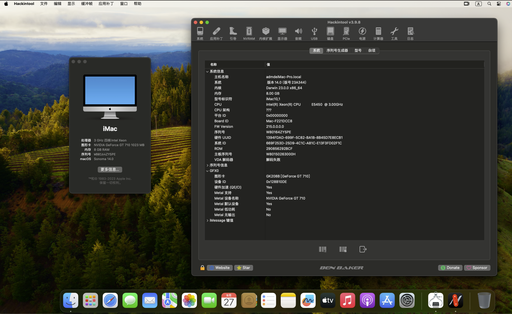

X58老平台：
     

  来自粉丝：【直升机爱好者】

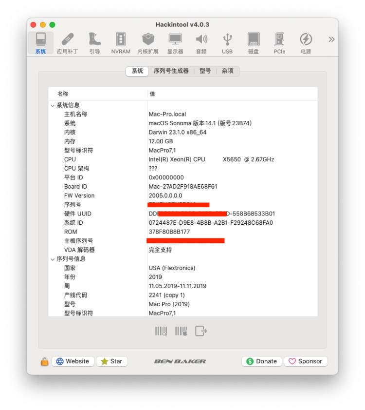

AMD FM2平台：
速龙X4 730，X4 760等都是支持的

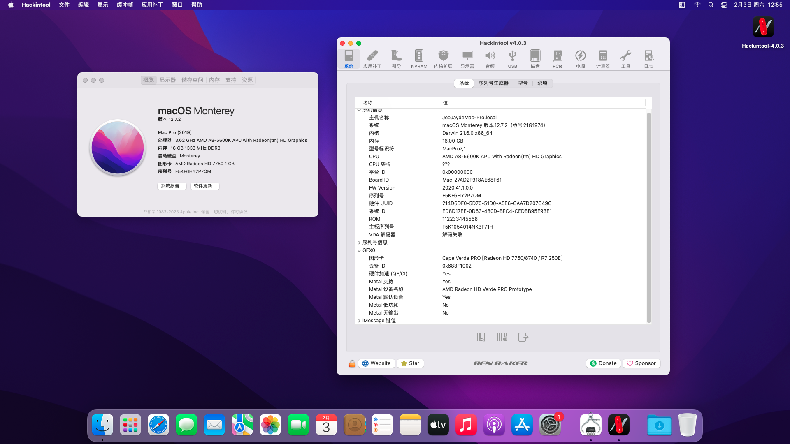

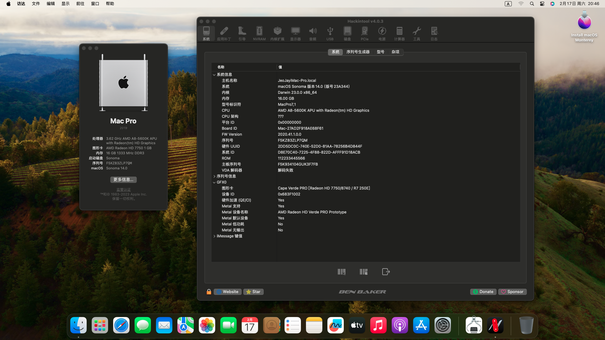

2代H61平台：

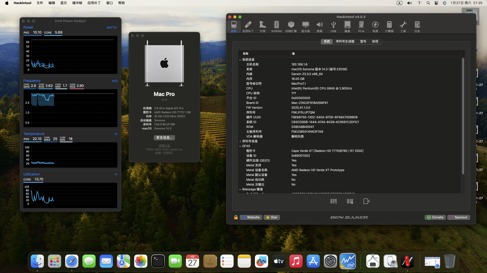

3代平台:

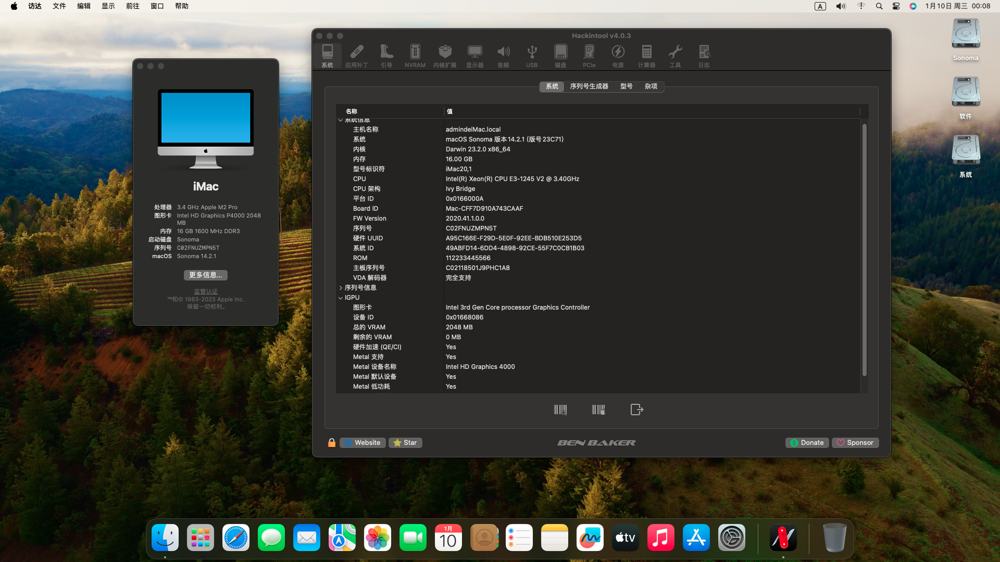

4代平台：

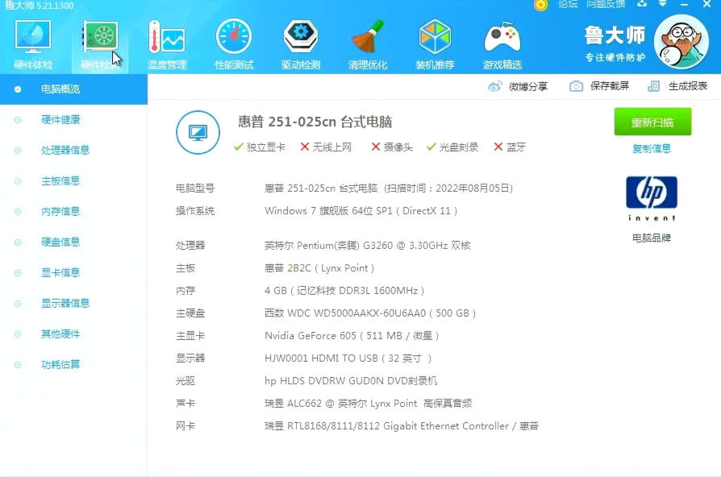

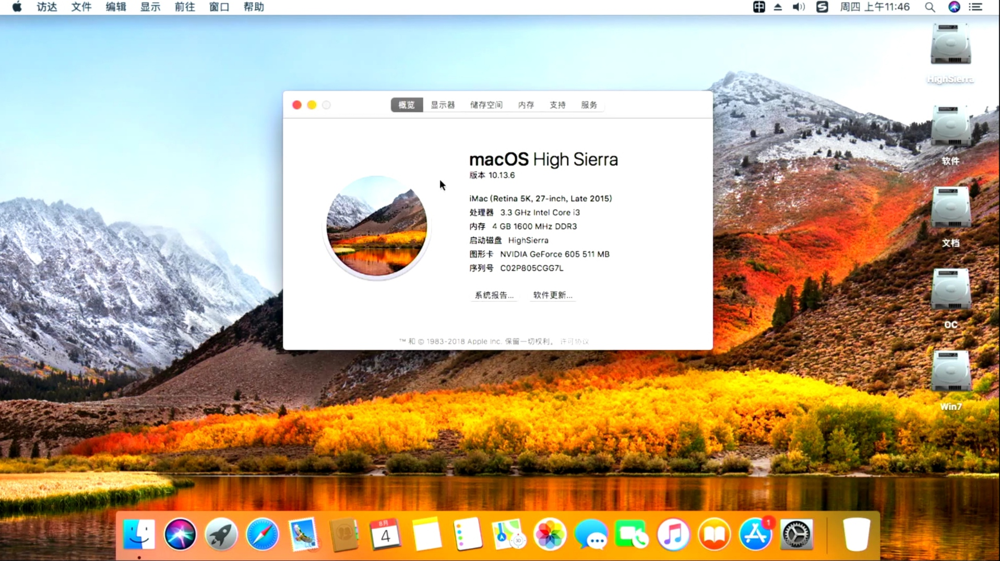

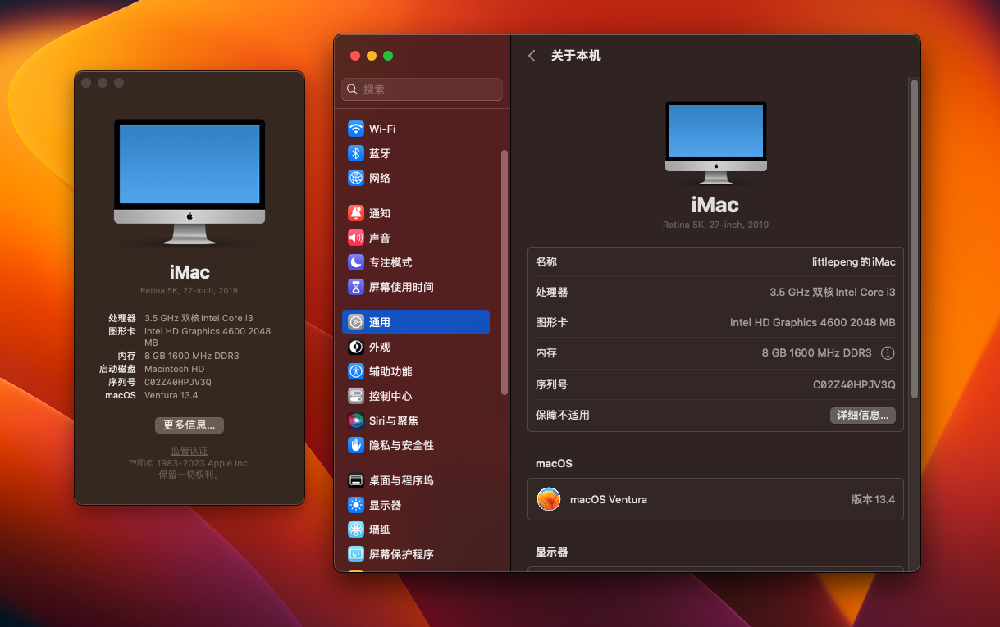

8代平台：

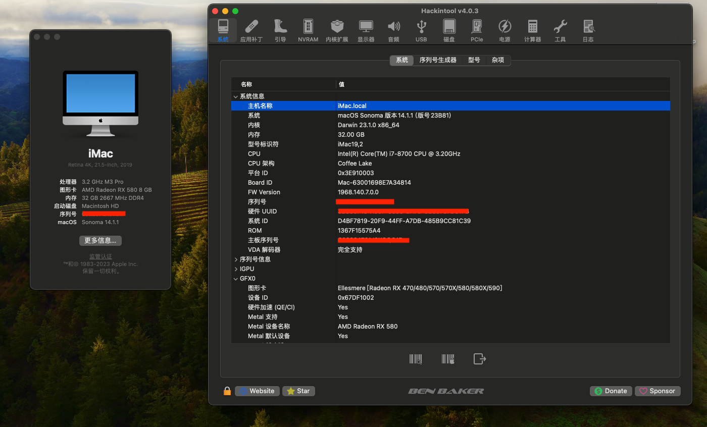

12代平台：

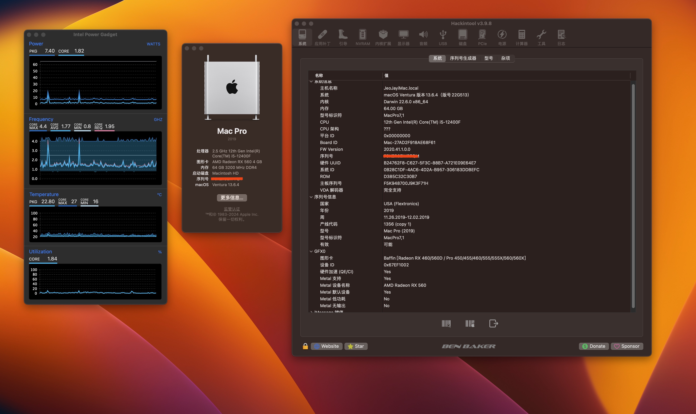

### 笔记本

1代平台【Aspire 3820ZG】

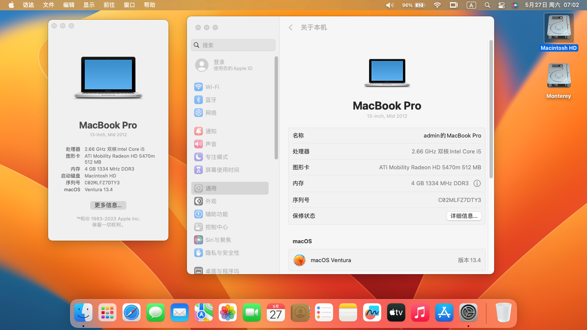

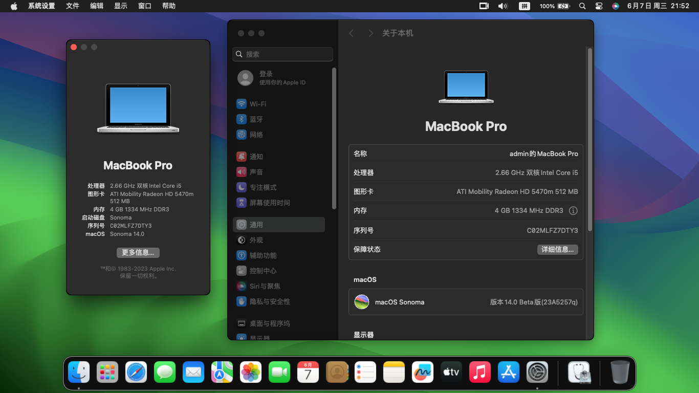

3代平台【华硕笔记本】
来自粉丝【瞌睡真的多】

4代平台【联想X240】

来自粉丝 【howl】

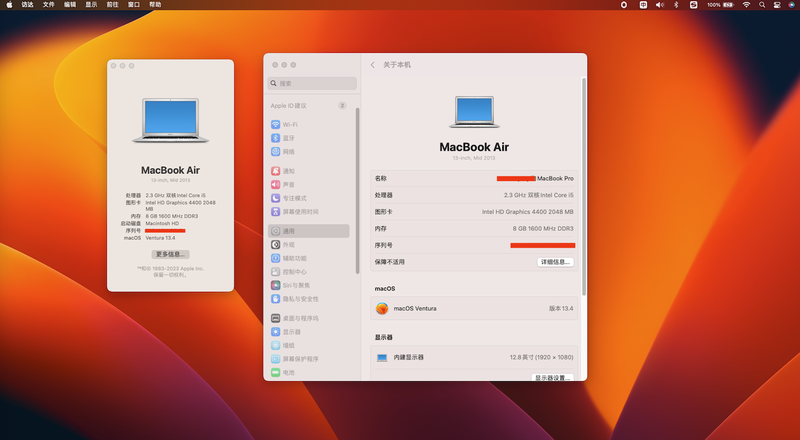

## 9.请开发者喝杯奶茶

如果有幸帮到了你，可以随意对开发者打赏！感谢支持！！！

    
    

## 10.打赏列表(目前仅展示部分，定期会更新)，不分先后

备注：有些打赏没有留下任何信息的大侠，在此一并感谢！！！

|             昵称              | 支付宝 | 微信 |  QQ  |
| :---------------------------: | :----: | :--: | :--: |
|      物语(QQ：51xxxxx25)      |        |  15  |      |
|       ^(QQ:10xxxxxx36)        |        |      |  30  |
|      笑笑(QQ：31xxxxx45)      |        |  15  |      |
|      pkg(QQ：13xxxxxx77)      |   50   |  50  |      |
|   esjjflzh(QQ：34xxxxxx74)    |        |  15  |      |
|      宋yx(QQ:22xxxxxx59)      |        |  20  |      |
|     知行难(QQ:21xxxxx87)      |        |  15  |      |
|  望眼已是浮云(QQ:25xxxxx36)   |        |  15  |      |
|      米浴(QQ:11xxxxx20)       |        |      |  15  |
|   此乃神人也(QQ:12xxxxx15)    |        |  20  |      |
|    金戈&铁马(QQ:13xxxxx34)    |        |  15  |      |
|    Kingying(QQ:47xxxxx44)     |        |  20  |      |
|   Sweeney Jin(QQ:75xxxxx53)   |        |  15  |      |
| 🎸吉他佬文森特🎸(QQ:36xxxxxx96) |        |  20  |      |
|   DG幸福数码(QQ:30xxxxx35)    |        |  20  |      |
|    汉武雄风(QQ:23xxxxx92)     |        |  15  |      |
|    Mr_Prince(QQ:71xxxxx92)    |        |  50  |      |
|   DG幸福数码(QQ:29xxxxxx34)   |        |  50  |      |
|   很久很久前(QQ:11xxxxxx83)   |        |  30  |      |
|    麦兜兜（QQ:31xxxxx74）     |        |  15  |      |
|    方波不方(QQ:27xxxxx96)     |        |  15  |      |
|   壶子里的油(QQ:94xxxxx14)    |        |      |  20  |

## 11.致谢

- [Acidanthera](https://github.com/Acidanthera)
  - OpenCorePkg, as well as many of the core kexts and tools

- [ChefKissInc](https://github.com/ChefKissInc)
  - [NootedRed](https://github.com/ChefKissInc/NootedRed) for Ryzen 2000 ~ 5000 iGPUs
  - [NootRX](https://github.com/ChefKissInc/NootRX) for RX6700,RX6750XT and so on
- [AMD-OSX](https://github.com/AMD-OSX/AMD_Vanilla)
  - Patches across 15h, 16h, 17h, and 19h
- [zxystd](https://github.com/zxystd)
  - Intel Wi-Fi Adapter Kernel Extension for macOS

- RapidEFI QQ群 -白给大师老18

  - 提供的12代及以上平台MacPro7,1机型睿频驱动
  - RapidEFI建议及Bug反馈

  

  

  

  

  

  

  

  

  

  

  

  
