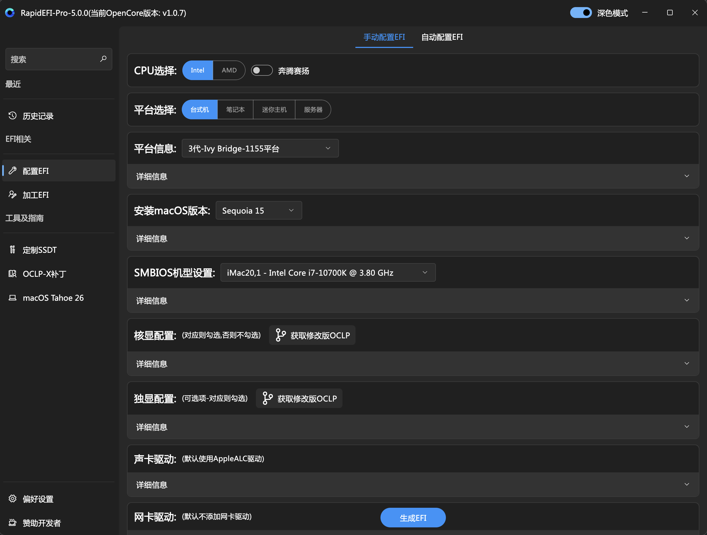
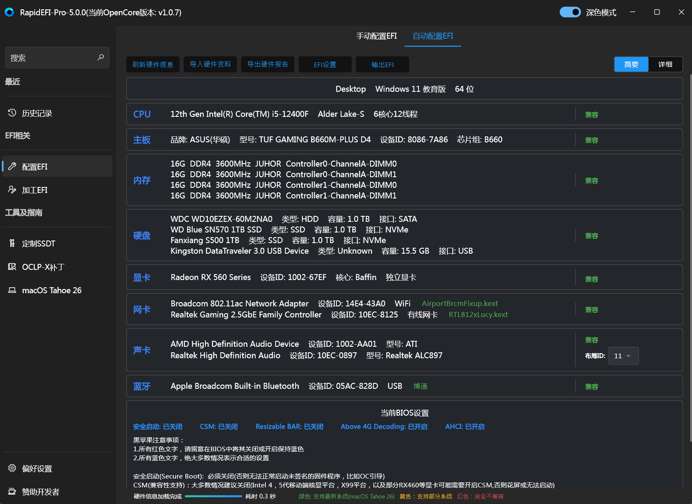
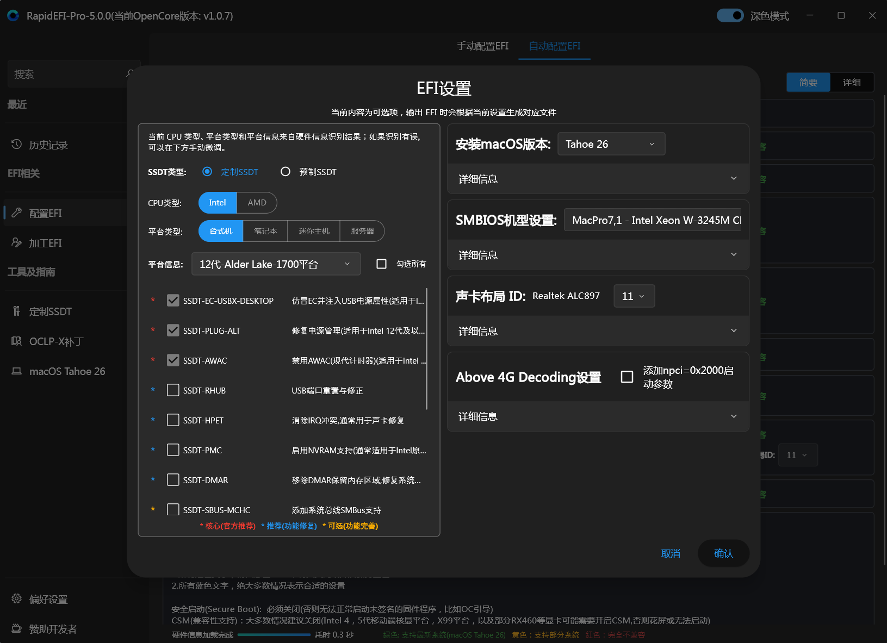
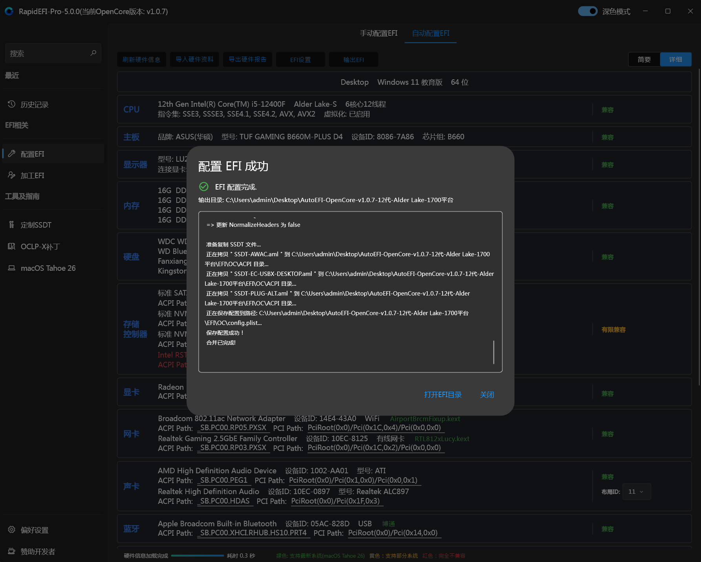

# RapidEFI

**一个面向普通用户的 OpenCore EFI 配置、自动生成与后期维护工具**

RapidEFI 可以帮助你手动配置 EFI、根据硬件信息自动生成 EFI、查看 macOS 兼容性、定制 SSDT，并在后续继续加工和维护已经生成的 EFI。

RapidEFI 的配置逻辑遵循 OpenCore 官方文档与 Dortania OpenCore 安装指南，尽量把官方推荐的配置流程整理成可视化、可检查、可继续维护的操作。

> RapidEFI 不能保证所有硬件都能一次成功启动 macOS。它的目标是把复杂的 OpenCore 配置流程整理成更清晰、可检查、可继续调整的操作。

## 快捷下载

<table>
  <tr>
    <td align="center">
      <strong>Windows 用户</strong> 
      
    </td>
    <td align="center">
      <strong>macOS 用户</strong> 
      
    </td>
    <td align="center">
      <strong>Linux 用户</strong> 
      
    </td>
  </tr>
</table>

## 重要说明

- 自动配置 EFI 依赖硬件信息、ACPI 表和内置规则判断，生成结果适合作为基础配置，不等于最终免调试配置。
- 输出 EFI 后建议先使用备用 U 盘测试启动，不要直接覆盖正在稳定使用的 EFI。
- 黑苹果安装和调试存在硬件差异，请务必提前备份重要数据。

## 目录

- [前言](#前言)
- [RapidEFI 是什么](#rapidefi-是什么)
- [软件预览](#软件预览)
- [主要优势与特点](#主要优势与特点)
- [核心功能](#核心功能)
- [快速开始](#快速开始)
- [软件兼容性](#软件兼容性)
- [支持的 macOS 版本](#支持的-macos-版本)
- [支持的平台](#支持的平台)
- [打赏作者](#打赏作者)
- [打赏列表](#打赏列表)
- [致谢](#致谢)
- [免责声明](#免责声明)

## 前言

随着苹果逐步转向自研芯片，黑苹果可折腾的空间正在变窄，愿意长期研究和维护 EFI 的人也比过去少了许多。但仍然有不少用户希望在现有硬件上继续探索 macOS，也希望 OpenCore 的配置过程不再只依赖手工编辑 `config.plist` 和反复查资料。

RapidEFI 正是为这种需求而生。它不是“万能一键工具”，也不承诺让每一台机器一次完美启动；它更像一个把常见配置流程整理好的助手：把平台选择、驱动、启动参数、显卡属性、声卡布局、网络、WiFi/OCLP、ACPI 和 SSDT 等内容尽量放到清晰的界面中，让用户可以看得懂、改得动、后续还能继续维护。

如果你是新手，可以先从自动配置 EFI 开始，快速生成一份基础 EFI；如果你已经有经验，也可以使用手动配置 EFI 精细调整每一项配置。RapidEFI 保持免费、离线、无广告，并随着真实硬件反馈继续完善。

## RapidEFI 是什么

RapidEFI 是一款基于 OpenCore 官方配置规范和 Dortania 指南思路设计的 EFI 配置与维护工具，主要用于：

- 可视化配置 OpenCore EFI。
- 根据硬件信息自动生成基础 EFI。
- 查看硬件信息和 macOS 兼容性提示。
- 根据 ACPI 表定制 SSDT。
- 自动处理部分不支持硬件的屏蔽、显卡仿冒、WiFi/OCLP 联动等配置。
- 对已经生成的 EFI 进行二次加工，减少手动编辑 `config.plist` 的成本。

RapidEFI 完全免费使用。它希望尽量降低 OpenCore 配置门槛，但仍建议用户保留基本的黑苹果常识，例如如何替换 EFI、如何进入 BIOS、如何使用 U 盘测试启动，以及如何在失败时恢复原系统。

更详细的功能说明可以查看：[功能介绍.md](docs/功能介绍.md)。

## 软件预览

## 主要优势与特点

- **图形化配置 EFI**：把常用 OpenCore 配置项整理为界面选项，降低直接编辑 `config.plist` 的压力。
- **手动与自动并存**：既适合有经验的用户精细调整，也适合新手从自动配置开始。
- **硬件信息与兼容性提示**：帮助判断 CPU、显卡、声卡、网卡、WiFi、蓝牙、磁盘等硬件在 macOS 下的大致支持情况。
- **自动配置 EFI**：根据硬件信息自动选择平台、驱动、启动参数、设备属性和部分修复项。
- **SSDT 自动定制**：在支持的环境下，可根据 ACPI 表生成定制 SSDT，并处理部分不支持设备的屏蔽和显卡仿冒。
- **WiFi/OCLP 联动**：针对部分 Intel、Broadcom、Atheros/Qualcomm WiFi，在对应系统版本下自动处理必要补丁和参数。
- **EFI 可持续维护**：输出 EFI 时保存 `configModel`，后续可以通过加工 EFI 再次调整。
- **历史记录自动保存**：每次成功生成 EFI 后保留记录，方便回看、对比和再次导出。
- **离线稳定运行**：工具核心能力全部内置，本地即可完成硬件识别、EFI 配置、SSDT 定制及导出，不依赖网络环境，即使无法访问 GitHub，也能稳定完成整个配置流程

## 核心功能

| 功能入口 | 适合谁 | 主要用途 |
| --- | --- | --- |
| 手动配置 EFI | 有一定经验的用户 | 自主选择平台、驱动、启动参数、显卡、声卡、网络等配置 |
| 硬件信息 | 想确认兼容性的用户 | 查看硬件信息、macOS 兼容性提示、导出硬件报告和 ACPI 表 |
| 自动配置 EFI | 新手用户 | 根据硬件信息自动生成 EFI，减少从零配置的难度 |
| 加工 EFI | 已经生成过 EFI 的用户 | 再次调整 EFI，例如去掉 `-v` 跑码、修改驱动或参数 |
| 历史记录 | 需要回看旧配置的用户 | 查找制作 EFI 的历史记录，方便对比、二次编辑和重新导出 |
| 定制 SSDT | 需要 ACPI 修复的用户 | 生成常见 SSDT 补丁，处理设备屏蔽、显卡仿冒、亮度、声卡等问题 |
| OCLP-X 补丁 | 需要新系统补丁的用户 | 查看显卡、WiFi 等 OCLP 相关补丁说明 |
| macOS Tahoe 26 | 准备安装 Tahoe 的用户 | 查看 Tahoe 相关注意事项与配置提示 |

## 快速开始

### 新手推荐流程

1. 打开 **配置 EFI -> 自动配置 EFI**。
2. 在 Windows 下点击 **刷新硬件信息**，等待硬件信息加载完成；也可以导入其他电脑导出的硬件资料。
3. 查看硬件兼容性提示，必要时进入 **EFI 设置** 调整 macOS 版本、声卡布局、SSDT 方案等。
4. 点击 **输出 EFI**，等待工具生成 EFI。
5. 使用备用 U 盘测试启动。
6. 如果需要继续调整，使用 **加工 EFI** 导入生成目录中的 `configModel`，无需手动编辑 `config.plist`。

### 给其他电脑制作 EFI

如果你是在另一台电脑上制作 EFI，可以先在目标电脑导出硬件报告和 ACPI 表，再在 RapidEFI 中使用 **导入硬件资料** 导入报告和 ACPI 表目录。没有 ACPI 表时仍可生成基础配置，但定制 SSDT 能力会受限。

## 软件兼容性

| 系统 | 支持情况 |
| --- | --- |
| Windows | 仅支持 Windows 10 及以上系统，支持 Windows 10、Windows 11 和对应虚拟机环境；不支持 Windows 8.1、Windows 8、Windows 7 及更早版本。推荐用于完整硬件采集、自动配置 EFI、导出硬件报告和定制 SSDT。建议使用前关闭 360、腾讯电脑管家、火绒等安全软件，避免生成或复制文件时被拦截。 |
| macOS | 支持 macOS Catalina 10.15 及以上系统；不支持 macOS Mojave 10.14 及更早版本。运行设备显卡需要支持 Metal，一般不建议在 macOS 虚拟机中使用，因为虚拟机显卡通常不支持 Metal。首次运行时如提示无法验证应用，需要在“系统设置 -> 隐私与安全性”中允许应用运行。 |
| Linux | 支持 Debian 10 及以上，以及 Ubuntu 20.04 LTS 到 Ubuntu 24.04 LTS；不支持 Ubuntu 20.04 及更早版本，也不支持 Ubuntu 24.10 及以上版本。Linux 下硬件采集能力与 Windows 不同，可使用 ACPI 导出和 iasl 相关能力。 |

> 如果你是新手，建议优先在 Windows 环境下使用自动配置 EFI，因为 Windows 下的硬件信息采集和自动配置流程最完整。

## 支持的 macOS 版本

RapidEFI 当前配置目标覆盖 macOS High Sierra 10.13  ~ macOS Tahoe 26 系统，更低版本需要自行测试。

## 支持的平台

RapidEFI 的平台模板会持续更新。当前主要覆盖：

| 平台 | 台式机 Desktop | 笔记本 Laptop | 迷你主机 NUC | 服务器 HEDT |
| :---: | --- | --- | --- | --- |
| Intel | 0 代到 15 代 | 0 代到 10 代，11 代及以上核显无法驱动 | 0 代到 10 代，11 代及以上核显无法驱动 | X58、X79、X99、X299、X599 |
| AMD | Bulldozer/Jaguar、Ryzen、Threadripper | Ryzen 系列 | Ryzen 系列 | Ryzen Threadripper |

备注：

- 这里的“0 代”主要指早期老平台，例如部分 Core 2/775 等历史平台，并非官方代际说法。
- AMD Bulldozer/Jaguar 主要覆盖部分 FM2、FM2+、AM3 等老平台方向，例如部分速龙、FX 系列处理器。
- 平台支持不等于所有硬件都能免调试。主板 BIOS、显卡连接方式、无线网卡型号、ACPI 表和目标 macOS 版本都会影响最终结果。

## 打赏作者

RapidEFI 是一个完全免费、离线、无广告的个人项目。为了让它跟上 OpenCore、Kext、macOS 版本和真实硬件环境的变化，背后需要持续投入很多业余时间：整理官方文档、适配规则、测试功能、修复问题，也要不断消化用户反馈中的各种特殊机器案例。

如果 RapidEFI 曾经帮你节省时间、少走弯路，或者让配置 EFI 这件事变得没那么令人头疼，欢迎用打赏的方式支持项目继续维护。金额多少都不重要，你的认可本身就是继续做下去的动力。

 

如果你更希望支持实际适配，也可以提供特殊硬件样本或完整硬件资料。比如家中闲置、已经用不上的老平台或特殊主板，像 G31、H55、FM1、FM2、AM3、X58、X79、X99，以及一些魔改 BIOS、魔改 CPU、非典型芯片组的主板，都可能对测试和规则完善很有价值。相比单纯的文字描述，真实机器、完整 ACPI 表和硬件报告往往更能帮助定位问题，也能让 RapidEFI 对更多平台的支持变得更可靠。

## 打赏列表

备注：有些打赏没有留下任何信息的大侠，在此一并感谢！！！

|             昵称              | 支付宝 | 微信 |  QQ  |
| :---------------------------: | :----: | :--: | :--: |
|      物语(QQ：51xxxxx25)      |        |  15  |      |
|       ^(QQ:10xxxxxx36)        |        |      |  30  |
|      笑笑(QQ：31xxxxx45)      |        |  15  |      |
|      pkg(QQ：13xxxxxx77)      |   50   |  50  |      |
|   esjjflzh(QQ：34xxxxxx74)    |        |  15  |      |
|      宋yx(QQ:22xxxxxx59)      |        |  20  |      |
|     知行难(QQ:21xxxxx87)      |        |  15  |      |
|  望眼已是浮云(QQ:25xxxxx36)   |        |  15  |      |
|      米浴(QQ:11xxxxx20)       |        |      |  15  |
|   此乃神人也(QQ:12xxxxx15)    |        |  20  |      |
|    金戈&铁马(QQ:13xxxxx34)    |        |  15  |      |
|    Kingying(QQ:47xxxxx44)     |        |  20  |      |
|   Sweeney Jin(QQ:75xxxxx53)   |        |  15  |      |
| 🎸吉他佬文森特🎸(QQ:36xxxxxx96) |        |  20  |      |
|   DG幸福数码(QQ:30xxxxx35)    |        |  20  |      |
|    汉武雄风(QQ:23xxxxx92)     |        |  15  |      |
|    Mr_Prince(QQ:71xxxxx92)    |        |  50  |      |
|    艺声之灵(QQ:29xxxxxx34)    |        | 150  |      |
|   很久很久前(QQ:11xxxxxx83)   |        |  30  |      |
|    麦兜兜（QQ:31xxxxx74）     |        |  15  |      |
|    方波不方(QQ:27xxxxx96)     |        |  15  |      |
|   壶子里的油(QQ:94xxxxx14)    |        |      |  20  |

## 致谢

RapidEFI 的完善离不开开源社区、黑苹果社区以及许多用户的长期经验积累。无论是一份文档、一个驱动、一次真实机器反馈，还是一块用于测试的硬件，都在帮助这个项目慢慢变得更可靠。

### 开源项目与文档

向 OpenCore、Acidanthera、Dortania、OCLP、AMD-OSX、zxystd、ChefKiss 以及相关项目的作者和维护者致以感谢与尊重。RapidEFI 的很多设计、规则和兼容性判断，都建立在这些开源项目、官方文档和社区经验之上。

- [Acidanthera](https://github.com/Acidanthera)：OpenCorePkg 以及大量核心 kext 和工具。
- [Dortania](https://dortania.github.io/)：OpenCore 安装指南和相关文档。
- [OpenCore Legacy Patcher](https://github.com/dortania/OpenCore-Legacy-Patcher)：新系统与老硬件补丁方向的重要参考。
- [AMD-OSX](https://github.com/AMD-OSX/AMD_Vanilla)：AMD 平台相关补丁和经验。
- [zxystd](https://github.com/zxystd)：Intel Wi-Fi 相关驱动项目。
- [ChefKiss](https://github.com/ChefKissInc)：NootedRed、NootRX 等 AMD 显卡相关驱动项目。

### 群友与硬件支持

也特别感谢 RapidEFI QQ 群里的朋友们。很多问题只有在真实机器上遇到过，才会知道应该如何改进；很多平台也只有拿到完整硬件资料，甚至实际硬件样本，才能做出更稳妥的适配。

无论是项目建议、Bug 反馈、协助测试、成功案例，还是对项目和作者个人测试环境的硬件赞助，这些支持都在实实在在地推动 RapidEFI 继续完善。还有很多没有一一写出名字的群友，也同样感谢你们长期以来的理解、提醒和陪伴。

- RapidEFI QQ 群 - 白给大老师
  - 提供 12 代及以上平台 MacPro7,1 机型睿频驱动
  - RapidEFI 建议及 Bug 反馈
- RapidEFI QQ 群主 - Pika
  - 赠送 B150 CPU 主板硬件套装，支持项目测试与适配
  - RapidEFI 建议及 Bug 反馈
- RapidEFI QQ 群测试与反馈用户
  - 包括鹰击长空、一个憨憨的电脑小白，以及更多长期协助测试、复现问题、反馈 Bug 和分享使用体验的群友

## 免责声明

RapidEFI 仅供学习、研究和个人维护使用。OpenCore、macOS 及相关驱动、补丁均属于各自项目或权利人。请遵守当地法律法规以及相关软件许可协议。

使用本工具生成或修改 EFI 可能导致无法启动、硬件功能异常或数据风险。请在操作前备份重要数据，并优先使用备用 U 盘测试启动。因使用本工具造成的任何损失，需要由使用者自行承担。
