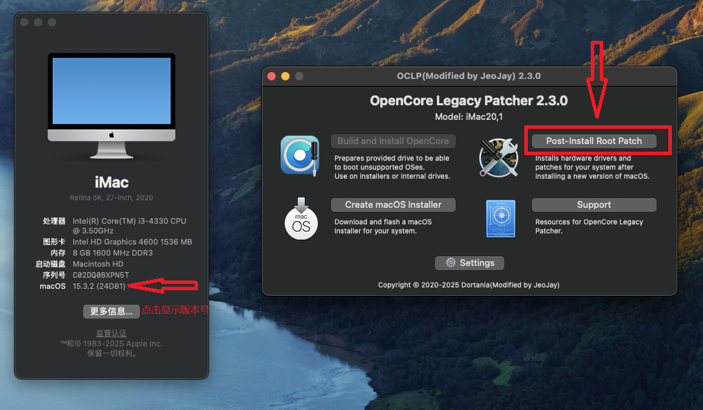

## 注意事项

1. 从 macOS Sequoia 15.x 系统开始，所有基于3802的GPU都需要下载[MetallibSupportPkg](https://github.com/dortania/MetallibSupportPkg/releases)。只要连接到互联网(国内用户自行做好科学上网)，OCLP将自动处理此问题。
2. 截止2026年5月,对于macOS Tahoe 26系统,所有显卡补丁都不支持(早在2025年6月份的时候,OCLP官方团队已经晒出开普勒N卡，HD4000等显卡驱动成功截图，但是官方并未放出OCLP补丁程序)！

  基于 3802 的 GPU：

  ✅ NVIDIA

    •	Kepler（GTX 600 - 700 系列）

  ✅ Intel

    •	Ivy Bridge（HD 4000 系列）

    •	Haswell（Iris / HD 4000-5000 系列）

  注意：在国内，由于网络墙的问题，可能会导致下载失败。如果遇到这种情况，你可以手动提前下载好对应系统版本号的[MetallibSupportPkg](https://github.com/dortania/MetallibSupportPkg/releases)安装(该链接也需要科学上网获取)

2. 从 macOS Ventura 13.x 开始，使用 AMD 旧款 GCN GPU（支持 Metal）的Mac设备在进行 Root Patching 时，需要联网下载Apple的[Kernel Debug Kit](https://developer.apple.com/download/all/?q=Kernel%20Debug%20Kit)（简称KDK） 以启动 Root Patching。

  如果你的系统无法连接到互联网，你可以手动从 Apple 官网下载相应的 KDK：

  请下载与你安装的 macOS 版本最接近的 [Kernel Debug Kit](https://developer.apple.com/download/all/?q=Kernel%20Debug%20Kit) 并安装到运行 Ventura 的设备上。

  ✅ AMD 旧款 GCN GPU（支持 Metal）

    •	AMD FirePro D300 / D500 / D700（Mac Pro 6,1）

    •	AMD Radeon R9 M290 / M295X（iMac 2014-2015）

    •	AMD Radeon R9 M380 / M390 / M395 / M395X（iMac 2015）

    •	AMD Radeon R9 M370X（MacBook Pro 2015）

  注意：请确保你下载的是与你的 Mac 型号和 macOS 版本相匹配的 [Kernel Debug Kit](https://developer.apple.com/download/all/?q=Kernel%20Debug%20Kit)（没有匹配的，考虑相近的）。如果你下载的是错误版本的 KDK，可能会导致 Root Patching 失败。

----------

# 不同 macOS 版本下需要修补的 GPU

## 以下条目表示 不再被 macOS 原生支持 的 GPU，即需要使用 OpenCore Legacy Patcher（OCLP） 进行 Root Volume Patch 才能运行：

### macOS Sequoia（macOS 15， 2024年发布）

  ✅ NVIDIA
   
    •	Tesla 系列（8000 - 300 系列）

    •	Kepler 系列（600 - 800 系列）

  ✅ AMD

    •	TeraScale 系列（2000 - 6000 系列）

    •	GCN 1-3 代（7000 - R9 系列）

    •	Polaris（RX 400 / RX 500 系列，如果 CPU 不支持 AVX2）

    •	AMD Navi（RX 5000 - 6000 系列），如果 CPU 不支持 AVX2）

  ✅ Intel

    •	Iron Lake（第一代酷睿 GPU ,仅移动端Arrandale处理器）

    •	Sandy Bridge（HD 3000 系列）

    •	Ivy Bridge（HD 4000 系列）

    •	Haswell（HD 4400、HD 4600、Iris 5000 系列）

    •	Broadwell（HD 6000 系列）

    •	Skylake（HD 500 系列）

### macOS Sonoma（macOS 14， 2023年发布）

  ✅ NVIDIA

    •	Tesla 系列（8000 - 300 系列）

    •	Kepler 系列（600 - 800 系列）

  ✅ AMD

    •	TeraScale 系列（2000 - 6000 系列）

    •	GCN 1-3 代（7000 - R9 系列）

    •	Polaris（RX 400 / RX 500 系列，如果 CPU 不支持 AVX2）

    •	AMD Navi（RX 5000 - 6000 系列），如果 CPU 不支持 AVX2）

  ✅ Intel

    •	Iron Lake（第一代酷睿 GPU ,仅移动端Arrandale处理器）

    •	Sandy Bridge（HD 3000 系列）

    •	Ivy Bridge（HD 4000 系列）

    •	Haswell（HD 4400、HD 4600、Iris 5000 系列）

    •	Broadwell（HD 6000 系列）

    •	Skylake（HD 500 系列）

### macOS Ventura（macOS 13， 2022年发布）

  ✅ NVIDIA

    •	Tesla 系列（8000 - 300 系列）

    •	Kepler 系列（600 - 800 系列）

  ✅ AMD

    •	TeraScale 系列（2000 - 6000 系列）

    •	GCN 1-3 代（7000 - R9 系列）

    •	Polaris（RX 400 / RX 500 系列，如果 CPU 不支持 AVX2）

    •	AMD Navi（RX 5000 - 6000 系列），如果 CPU 不支持 AVX2）

  ✅ Intel

    •	Iron Lake（第一代酷睿 GPU ,仅移动端Arrandale处理器）

    •	Sandy Bridge（HD 3000 系列）

    •	Ivy Bridge（HD 4000 系列）

    •	Haswell（HD 4400、HD 4600、Iris 5000 系列）

    •	Broadwell（HD 6000 系列）

    •	Skylake（HD 500 系列）

### macOS Monterey（macOS 12， 2021年发布）

  ✅ NVIDIA

    •	Tesla 系列（8000 - 300 系列）

    •	Kepler 系列（600 - 800 系列）

  ✅ AMD

    •	TeraScale 系列（2000 - 6000 系列）

  ✅ Intel

    •	Iron Lake（第一代酷睿 GPU ,仅移动端Arrandale处理器）

    •	Sandy Bridge（HD 3000 系列）

    •	Ivy Bridge（HD 4000 系列）

### macOS Big Sur（macOS 11， 2020年发布）

  ✅ NVIDIA

    •	Tesla 系列（8000 - 300 系列）

  ✅ AMD

    •	TeraScale 系列（2000 - 6000 系列）

  ✅ Intel

    •	Iron Lake（第一代酷睿 GPU ,仅移动端Arrandale处理器）

    •	Sandy Bridge（HD 3000 系列）
    

## 总结

	1.	所有 macOS 版本（Big Sur 及更新）原生都不支持 NVIDIA Tesla 系列 & AMD TeraScale 系列 GPU, 需要OCLP补丁。

	2.	macOS Monterey 及更高版本(这里只谈正式版)官方放弃对 Intel Ivy Bridge（HD 4000）及更早 GPU 的原生支持, 需要OCLP补丁。

	3.	macOS Ventura / Sonoma / Sequoia 进一步移除对 NVIDIA Kepler（GTX 600-700）及 AMD GCN 1-3（HD 7000 - R9）系列的支持，需要OCLP补丁。

	4.	AMD Navi（RX 5000 - 6000 系列）在 2008 - 2012 Mac Pro 上无法使用 Ventura 及更新版本，因为 缺少 AVX2 指令集支持，需要禁用AMD显卡加速(添加启动参数-amd_no_dgpu_accel,OCLP打完补丁后去掉该参数重启电脑)，然后OCLP补丁。

	5.	RX 400 / RX 500（Polaris）系列在 CPU 不支持 AVX2 的情况下，Ventura 及更新版本，需要禁用AMD显卡加速(添加启动参数-amd_no_dgpu_accel,OCLP打完补丁后去掉该参数重启电脑)，也需要OCLP补丁。

----------

## OCLP 补丁步骤

   
  
  

  1. 禁用SIP及AMFI
  
      • 禁用SIP(System Integrity Protection),  在 NVRAM-Add-7C436110-AB2A-4BBB-A880-FE41995C9F82 中设置csr-active-config为03080000(也可以使用FF0F0000彻底禁用)

      • 禁用AMFI(Apple Mobile File Integrity), 在 NVRAM-Add-7C436110-AB2A-4BBB-A880-FE41995C9F82 中设置amfi=0x80或者使用v1.4.1版或更新版本的AMFIPass.kext。
      (如果不考虑安全原因，可以使用amfi_get_out_of_my_way=0x1来彻底禁用AMFI)

      • SecureBootModel 设置为Disabled，具体操作：Misc -> Security ->SecureBootModel -> Disabled

      • 关闭“文件保险箱”功能：系统设置 > 隐私与安全性 > 文件保险箱 > 关闭

      • 添加NVRAM删除（主要是为了避免重启Reset NVRAM这一步操作），在 NVRAM-Delete-7C436110-AB2A-4BBB-A880-FE41995C9F82 中添加以下值：

        boot-args

        csr-active-config

      • 重启一次电脑，确保以上操作生效。
  

  2. 下载 [OpenCore-Patcher.pkg](https://github.com/JeoJay127/OCLP-X/releases),注意国内网络问题，你可能需要科学上网！

  3. 参考上述 【注意事项】 中的说明：
     
      - 1.下载安装对应系统版本的,如果是 Sequoia 15.x 以下系统，无需下载 [MetallibSupportPkg](https://github.com/dortania/MetallibSupportPkg/releases)

      - 2.下载安装对应系统版本的 Kernel Debug Kit 。
         
         Apple官方[Kernel Debug Kit](https://developer.apple.com/download/all/?q=Kernel%20Debug%20Kit),需要登陆你的Apple账号

         Dortania仓库[Kernel Debug Kit](https://github.com/dortania/KdkSupportPkg/releases)

  4.	安装 [OpenCore-Patcher.pkg](https://github.com/JeoJay127/OCLP-X/releases)，注意在系统设置中【安全与隐私】- 【安全性】允许安装任何来源的软件！
       
      或者一劳永逸做法,打开终端输入： sudo spctl --master-disable

  5.	打开 OpenCore-Patcher

     依次点击运行 Post-Install Root Patch -> Start Root Patching,等待完成后重启即可。

      
----------

## OCLP常见问题

  1. 启动后出现“OpenCore-Patcher.pkg”已损坏，无法打开。您应该将它移到废纸篓。
     或者出现：Apple无法验证“OpenCore-Patcher.pkg”是否包含可能危害Mac安全或泄露隐私的恶意软件
   
     解决方法：
     
       1) 在系统设置中【安全与隐私】- 【安全性】允许安装任何来源的软件

       2) 或者一劳永逸做法,打开终端输入： sudo spctl --master-disable

  2. 点击运行 Post-Install Root Patch 后，“Start Root Patching”为灰色，不能点击

     解决方法： 

      1) 确认SIP，AMFI已禁用，显卡，WiFi等硬件在OCLP支持列表

      2) 如果是显卡，则排查device-id是否正确仿冒，如果是WiFi排查IOName是否正确仿冒

3. 依次点击运行 Post-Install Root Patch -> Start Root Patching 后，提示没有网络，需要连接到互联网。

    解决方法：

      1) 你可能需要科学上网，或者下载好对应系统版本的 [Kernel Debug Kit](https://developer.apple.com/download/all/?q=Kernel%20Debug%20Kit)，甚至可能需要 [MetallibSupportPkg](https://github.com/dortania/MetallibSupportPkg/releases)。你可以参考上述 【注意事项】 中的说明

      2) 步骤1下载好后，将其安装之后，重新运行OCLP。

4. 打完OCLP补丁之后无法进入系统

   解决方法：

    1) 检查AMFI，kernel阻止补丁，Kext等是否正确配置, 完善这些配置后，重启电脑，再次尝试

    2) 当务之急，你可能无法正常进入系统。可以添加启动参数-x，尝试以安全模式进入Mac。如果安全模式无法进入，请进入Mac Recovery恢复模式，然后使用终端命令行卸载OCLP补丁，恢复补丁前状态，这样不用重装系统。访问OCLP官方文档 [如何卸载OCLP补丁](https://dortania.github.io/OpenCore-Legacy-Patcher/TROUBLESHOOTING.html#stuck-on-boot-after-root-patching)

5. 对于AMD TeraScale老A卡(比如：HD5770) 在macOS Mojave 10.14 及 macOS Catalina 10.15 系统打完补丁后，没有QE/CI硬件加速，底部Dock栏非半透明

   解决方法：
   
    1) 建议使用OCLP 0.4.3 TUI版本(Terminal终端,以防在没有驱动显卡情况下，图形UI渲染失败，导致OCLP闪退)
   
    2) 打开OCLP 0.4.3 TUI版本后，先点击settings 进入，勾选 “Allow Accle on 10.14/15”,再返回打补丁

  
6. 更多关于OCLP话题，可以访问[OCLP官方指南](https://dortania.github.io/OpenCore-Legacy-Patcher/START.html)
  

  

  

  

  

  

  

  

  

  
