# macOS 支持哪些WiFi？

### **支持的WiFi**：

 1. 支持英特尔 Intel Wi-Fi 适配器，详见[Intel Wi-Fi网卡](https://openintelwireless.github.io/itlwm/Compat.html)

 2. 支持博通Broadcom Wi-Fi 适配器，详见[Broadcom Wi-Fi网卡](https://dortania.github.io/Wireless-Buyers-Guide/unsupported.html#supported-chipsets)

 3. 支持高通Atheros Wi-Fi 适配器，详见[Atheros Wi-Fi网卡](https://dortania.github.io/Wireless-Buyers-Guide/unsupported.html#supported-chipsets)

### **不支持的WiFi（不仅限于此）**：

 1. 所有macOS版本都不支持 Realtek Wi-Fi PCI类型适配器 (注意不包括USB类型适配器)
 2. 所有macOS版本都不支持 TP-Link Wi-Fi PCI类型适配器(注意不包括USB类型适配器)
 3. 如下博通无线网卡：BCM4312， BCM4313，BCM4356，BCM43142，BCM43228
 4. 如下高通无线网卡：AR5424
 5. ... 

----------
### **温馨提示**：

 **1.RapidEFI工具WiFi板块：目前支持 Intel Wi-Fi , Broadcom Wi-Fi , Atheros Wi-Fi三种常见类型WiFi配置,根据WiFi型号直接勾选，自动应用相关Kext及Patch补丁，无需手动添加(高版本macOS最多需要OCLP补丁)！！！**

 **2.对于Intel, Broadcom Wi-Fi，会自动添加蓝牙驱动，Atheros Wi-Fi不会自动添加蓝牙驱动,可以在蓝牙板块勾选添加**

 **3.以下只是介绍WiFi简单驱动原理及过程，仅供参考！**

----------

# Intel 无线网卡（WiFi）

## 如何使Intel WiFi 在macOS 工作？

感谢[zxystd](https://github.com/zxystd) 大佬的贡献！需要Intel WiFi驱动,可以去他的仓库[AirportItlwm](https://github.com/OpenIntelWireless/itlwm/releases)下载。

### Intel WiFi驱动方法

注意：驱动方式一和驱动方式二只能选择其中一个,不能同时使用！！！

#### 驱动方式一：使用[AirportItlwm](https://github.com/OpenIntelWireless/itlwm/releases)驱动 (RapidEFI工具WiFi板块直接勾选，自动应用相关Kext及补丁，无需手动添加！！！)

- 1.确保驱动方式二中所有相关驱动及补丁都已经删除干净。

- 2.对于macOS High Serrira 10.13 ~ macOS Catalina 10.15系统,除了使用对应系统版本的AirportItlwm驱动外，还需要一个Force补丁。

Kernel - Force中新增补丁：

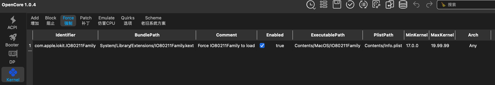

- 3.对于macOS Big Sur 11.0 ~ macOS Sonoma 14.x,使用对应系统版本的AirportItlwm驱动即可。

  需要注意的是，如果你是macOS Sonoma 14.4以上的系统，需要使用macOS Sonoma 14.4的AirportItlwm驱动，如果是macOS Sonoma 14.0 ～ 14.3系统，需要使用macOS Sonoma 14.0的AirportItlwm驱动。

- 4.对于macOS Sequoia 15系统,由于目前还没有对应系统的原生AirportItlwm驱动(后续可能会有)，目前做法是使用macOS Ventura系统对应的AirportItlwm驱动(所以有些时候，你会看到AirportItlwm_Sequoia.kext,其实很可能就是Ventura系统对应的AirportItlwm驱动改名而已，为了很好区分，以下内容也会采用这种做法)，但是需要添加一些驱动和补丁。

对于macOS Sequoia 15系统，建议按照以下步骤进行操作(打开你的config)：

   - 禁用SIP(System Integrity Protection),  在 NVRAM-Add-7C436110-AB2A-4BBB-A880-FE41995C9F82 中设置csr-active-config为03080000(也可以使用FF0F0000彻底禁用)
   - 禁用AMFI(Apple Mobile File Integrity), 在 NVRAM-Add-7C436110-AB2A-4BBB-A880-FE41995C9F82 中设置amfi=0x80或者使用v1.4.1版或更新版本的AMFIPass.kext。(如果不考虑安全原因，可以使用amfi_get_out_of_my_way=0x1来彻底禁用AMFI)
   - SecureBootModel 设置为Disabled，具体操作：Misc -> Security ->SecureBootModel -> Disabled
   - 关闭“文件保险箱”功能：系统设置 > 隐私与安全性 > 文件保险箱 > 关闭
   - 添加NVRAM删除（主要是为了避免重启Reset NVRAM这一步操作），在 NVRAM-Delete-7C436110-AB2A-4BBB-A880-FE41995C9F82 中添加以下值：

     boot-args

     csr-active-config

   - 重启一次电脑，确保以上操作生效。

需要的kext驱动(注意保持如下顺序)：

注：
  1. AirportItlwm_Sequoia.kext 就是Ventura系统对应的AirportItlwm驱动改名而已！！！
  2. 上述 IOSkywalkFamily.kext和IO80211FamilyLegacy.kext可以到仓库 [IOSkywalkFamily&IO80211FamilyLegacy](https://github.com/JeoJay127/OCLP-X/tree/main/payloads/Kexts/Wifi)获取

Kernel - Block 中新增补丁：
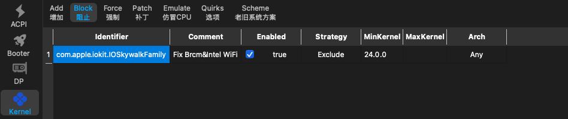

下载此修改版本OpenCore Legacy Patcher,安装运行它，点击Post-Install Root Patch -> Start Root Patching，完成后重启即可。

  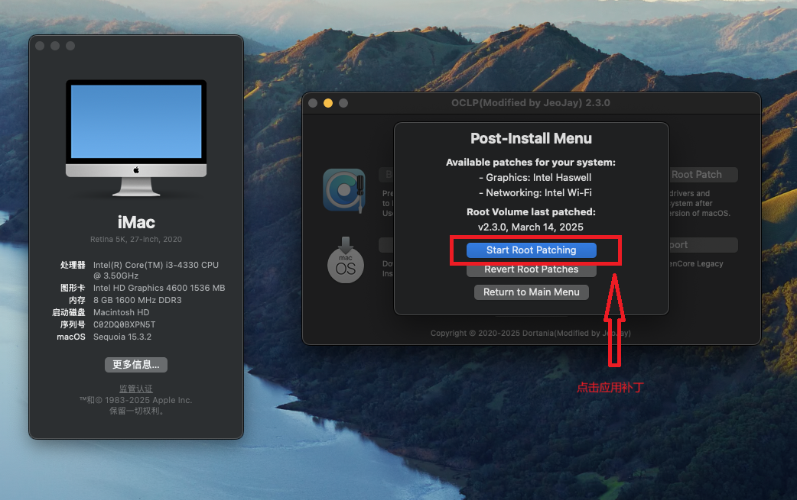

#### 驱动方式二：使用[HeliPort](https://github.com/OpenIntelWireless/HeliPort/releases) + [Itlwm](https://github.com/OpenIntelWireless/itlwm/releases) 驱动

- 1.确保驱动方式一中所有相关驱动及补丁都已经删除干净。

- 2.添加Itlwm驱动，然后安装HeliPort客户端。

 注：对于intel无线网卡，可以使用HeliPort + Itlwm无限制版本(支持macOS High Serrira 10.13 ~ macOS Tahoe 26)

#### 驱动方式三

- 仅使用IOName仿冒Brcm博通无线网卡，使用官方原版OCLP打补丁即可。这里不做详细介绍

## macOS Ventura 及更新版本的 Intel 蓝牙驱动

•	建议定制好USB

•	NVRAM 设置：在 NVRAM-Add-7C436110-AB2A-4BBB-A880-FE41995C9F82 中，新增以下两个条目：

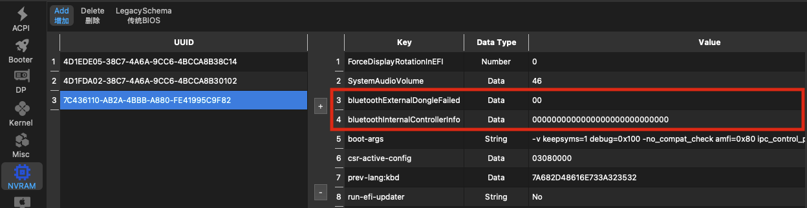

 备用(例如：Intel AX201，AX200无线网卡)：

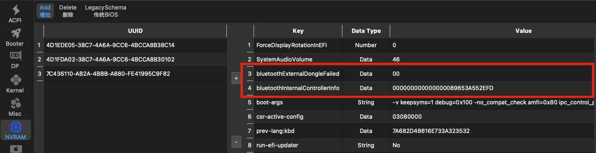

需要的kext驱动：

可以从以下仓库下载以上最新kext驱动：

[BlueToolFixup.kext](https://github.com/acidanthera/BrcmPatchRAM/releases)

[IntelBTPatcher.kext](https://github.com/OpenIntelWireless/IntelBluetoothFirmware/releases)

[IntelBluetoothFirmware.kext](https://github.com/OpenIntelWireless/IntelBluetoothFirmware/releases)

----------

# Broadcom WiFi（博通无线网卡）

## 如何使Broadcom WiFi 在macOS工作？

1. 原生免驱BCM94360系列(Apple AirPort系列，奋威系列（Fenvi cards），蓝牙免驱)，无需额外驱动，最高免驱支持macOS Ventura 13.x 系统，更高macOS版本需要OCLP打补丁！

当前支持的芯片组：

    BCM943602CDP
    BCM943602CD
    BCM94360CD
    BCM94331CD
    BCM94360CS2
    BCM943602CS
    BCM94360CSAX
    BCM94360CS
    BCM94352Z
    BCM94350ZAE
      
    BCM94360CD (ABGN+AC):
    
      Fenvi FV T919 (Bluetooth 4.0)
      Fenvi AC1900 (无蓝牙, EOL)
      TP-LINK Archer T9E AC1900 (无蓝牙)
      TP-LINK Archer T8E (无蓝牙)
      RNX-AC1900PCE (无蓝牙)
      ASUS PCE-AC66 (无蓝牙)
      ASUS PCE-AC68 (无蓝牙)
    
    BCM94360CS2 (ABGN+AC):
    
      Fenvi FV-HB1200 (Bluetooth 4.0)
      AWD Wireless LAN Card (无蓝牙)
    
    BCM94352 (ABGN+AC):
    
      TP-LINK Archer T6 (无蓝牙)
      Rosewill RNX-AC1300PCE (无蓝牙)
      ASUS PCE-AC56 (无蓝牙)

   macOS Sonoma 14.x ~ macOS Sequoia 15.x ： 禁用SIP，AMFI，需要额外驱动IOSkywalkFamily 和 IO80211FamilyLegacy及Block补丁，使用OCLP打补丁重启即可。具体操作可以参考以下截图：

    所需Kexts列表

   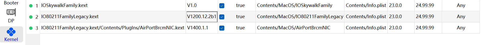

    所需Block补丁

   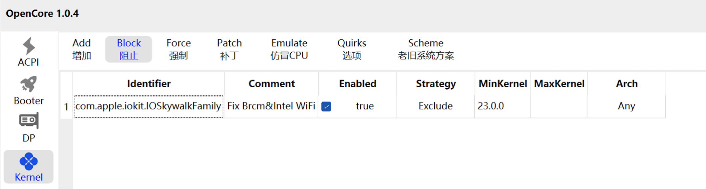

2.除了上述1中Apple AirPort 和 Fenvi 卡外，其他Broadcom无线网卡都需要额外AirportBrcmFixup驱动

   macOS Monterey 12.x ~ macOS Sequoia 15.x系统，所需Kexts列表(注意保持kext顺序). 需要下面Block补丁

   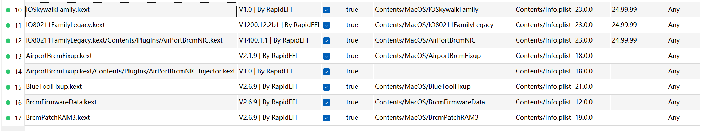
   

   macOS mojave 10.14.x ~ macOS catalina 10.15.x系统，所需Kexts列表(注意保持kext顺序).可能需要下面Force补丁

  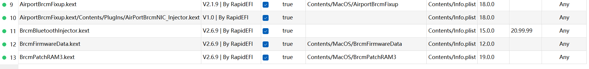
  

3.对于那种传统的Broadcom 4331，43224无线网卡，需要额外[corecaptureElCap&IO80211ElCap](https://github.com/JeoJay127/OCLP-X/tree/main/payloads/Kexts/Wifi)驱动，然后OCLP 打补丁即可。

  參考截图：注意保持kext顺序，根据网卡具体型号勾选下面IO80211ElCap中子驱动
  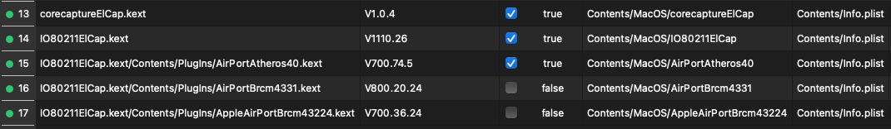 

----------

# Atheros WiFi（高通无线网卡）

高通无线网卡型号：

| 设备ID | 型号 |
|------|------|
| 002A | AR928X |
| 002B | AR9285 |
| 002E | AR9287 |
| 001C | AR242x / AR542x |
| 0023 | AR5416 - never used by Apple |
| 0024 | AR5418 |
| 0030 | AR93xx/AR9380 |
| 0032 | AR9485 |
| 0033 | AR958x |
| 0034 | AR9462 |
| 0036 | AR9565 |
| 0037 | AR9485 |

注：
   1. 以上这些过时Atheros无线网卡，速度都比较慢，体验也很差，所以一般不建议使用。

   2. 使用RapidEFI工具配置的Atheros无线网卡驱动，最高支持 macOS Sequoia 15.x 系统 (对于macOS Monterey 12.x ~ macOS Sequoia 15.x 系统,需要额外使用OCLP打补丁方可正常使用！！！)

  macOS Monterey 12.x 及以上所需Kext驱动(注意保持kext顺序)： 点击获取驱动[corecaptureElCap&IO80211ElCap驱动](https://github.com/JeoJay127/OCLP-X/tree/main/payloads/Kexts/Wifi)

   

  macOS Sequoia 15 高通AR9380无线网卡:

  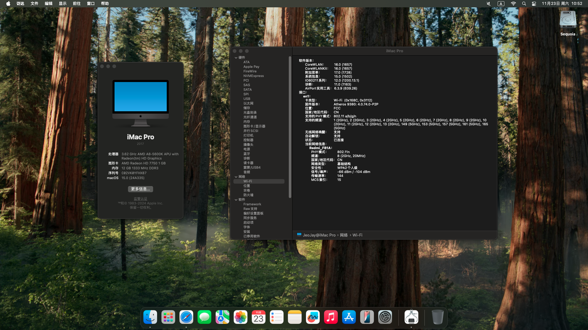