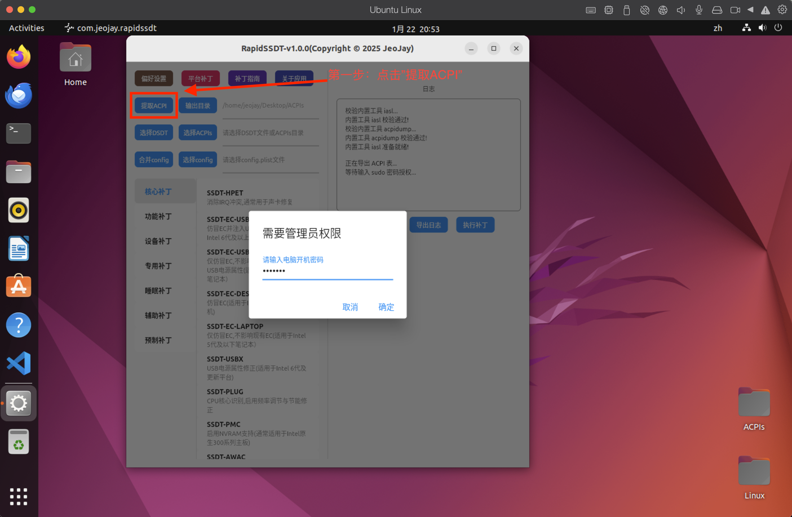
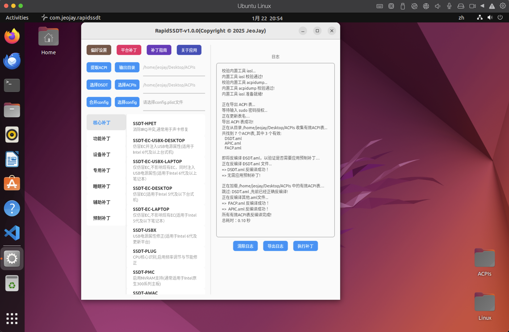

## RapidSSDT使用指南

- [1.RapidSSDT制作的SSDT补丁支持哪些引导](#1RapidSSDT制作的SSDT补丁支持哪些引导)
- [2.如何使用RapidSSDT提取本机SSDT与DSDT](#2如何使用RapidSSDT提取本机SSDT与DSDT)
- [3.如何确定需要哪些SSDT](#3如何确定需要哪些SSDT)
- [4.如何使用RapidSSDT制作SSDT补丁](#4如何使用RapidSSDT制作SSDT补丁)
- [5.如何使用RapidSSDT快速制作所有SSDT补丁](#5如何使用RapidSSDT快速制作所有SSDT补丁)
- [6.如何使用RapidSSDT将SSDT补丁合并应用到自己EFI中](#6如何使用RapidSSDT将SSDT补丁合并应用到自己EFI中)
- [7.常见SSDT补丁详细指南](#7常见SSDT补丁详细指南)
- [8.致谢](#8致谢)

## 获取RapidSSDT最新版本

[访问 https://github.com/JeoJay127/RapidSSDT/releases 获取最新版本](https://github.com/JeoJay127/RapidSSDT/releases)

## 1.RapidSSDT制作的SSDT补丁支持哪些引导

RapidSSDT 并不绑定于某一种引导方案，而是围绕 **ACPI / SSDT 补丁本身**进行设计，目前支持主流 Hackintosh 引导程序的使用场景。

- 🟢 **OpenCore** (目前主流，推荐)

  - 针对 OpenCore 的 ACPI 加载机制进行设计
  - 生成的 SSDT 可直接放入 EFI/OC/ACPI 目录
  - 补丁命名与结构更符合 OpenCore 的使用习惯
  - 适用于当前主流 Hackintosh 配置方案
- 🟢 **Clover** (已过时，不推荐)

  - 支持 Clover 的 ACPI 补丁加载方式
  - 生成的 SSDT 可用于 EFI/CLOVER/ACPI/patched
  - 兼容传统 Clover 用户的使用习惯
  - 适用于仍在使用 Clover 的老平台或维护场景

## 2.如何使用RapidSSDT提取本机SSDT与DSDT

##### **注意事项:** 

如果更改了以下任何一项，您必须重新提取、重新补丁，因为这些更改可能会导致本机ACPI（特别是SystemMemory区域）发生重大更改：

- 更新BIOS

- 更改任何BIOS选项

- 更改硬件或内存配置

##### 2.1 使用Windows提取(推荐)

  - 确保使用原生Boot Manager 方式来启动Windows，如果你使用了三方引导，比如：OpenCore来引导进入Windows系统，那么提取的ACPI表几乎已经被OpenCore注入的ACPI补丁污染，并非原始ACPI表！

**Win下打开RapidSSDT,找到可执行文件rapidssdt.exe,双击运行,点击【提取ACPI】按钮,即可提取本机的SSDT与DSDT.**

**Win下提取完成后,默认输出在Desktop桌面ACPIs文件夹, 同时【选择ACPIs】路径这一块,会自动选择该文件夹，后续补丁操作都将基于该文件夹.无需手动选择！！！**

##### 2.2 使用Linux提取(可选)  

 - 已经安装好Linux的情况下,可以使用Linux来提取ACPI表.一般不建议专门安装Linux来提取ACPI表

 **Linux下点击【提取ACPI】按钮，输入sudo密码后,即可提取本机的SSDT与DSDT.**

 

 

##### 2.3 使用macOS提取(不推荐,可能出现一些问题)  

 - 不建议在macOS上提取ACPI表,因为绝大多数启动场景下,macOS都已经被OpenCore等引导器注入了ACPI补丁,提取的ACPI表几乎已经被污染,并非原始ACPI表!

 - 如果已经安装了macOS，并且目前没有使用任何补丁的ACPI文件启动，那么可以在Mac系统提取ACPI,否则不建议在Mac系统提取ACPI.

 **macOS下点击【提取ACPI】按钮,即可提取本机的SSDT与DSDT.请注意,提取的ACPI表几乎已经被污染,并非原始ACPI表!**

 

## 3.如何确定需要哪些SSDT

 为了方便快速确定需要哪些SSDT, RapidSSDT 提供了一个平台补丁,打开后,会自动列出当前平台所需的所有SSDT(核心补丁和推荐补丁).

 **注意: 大多数平台所需的SSDT,推荐【核心补丁】和【推荐补丁】即可,至于【可选补丁】（亦或是未列出的SSDT补丁）根据实际情况选择是否使用,进一步完善.**

 平台补丁主要根据CPU类型(Intel 或 AMD) , 平台类型(台式机,笔记本,迷你主机,服务器),具体平台信息(所属哪一代)来确定需要哪些SSDT.所有这些来源于官方指南: [https://dortania.github.io/Getting-Started-With-ACPI/ssdt-platform.html#desktop](https://dortania.github.io/Getting-Started-With-ACPI/ssdt-platform.html#desktop)

## 4.如何使用RapidSSDT制作SSDT补丁

 RapidSSDT 制作SSDT补丁流程:

 - **4.1 直接提取本机DSDT、SSDT,给当前正在使用的电脑制作SSDT补丁**
   
   简要步骤: 【提取ACPI】->【选择SSDT补丁】->【执行补丁】->【选择config】->【合并config】
   

  【提取ACPI】:

  

  【选择SSDT补丁】,【执行补丁】:

  

  【选择config】:

  【合并config】:

  

 - **4.2 非本机DSDT、SSDT,给他人已经提取好的DSDT、SSDT制作SSDT补丁**

   简要步骤: 【选择ACPIs】->【选择SSDT补丁】->【执行补丁】->【选择config】->【合并config】

   与[4.1 直接提取本机DSDT、SSDT,给当前正在使用的电脑制作SSDT补丁](#4.1-直接提取本机DSDTSSDT-给当前正在使用的电脑制作SSDT补丁)基本相同,只是【选择ACPIs】这一步,需要选择他人已经提取好的DSDT、SSDT所在文件夹(或者DSDT文件)
   
   【选择ACPIs】:

   

  后面操作与[4.1 直接提取本机DSDT、SSDT,给当前正在使用的电脑制作SSDT补丁](#4.1-直接提取本机DSDTSSDT-给当前正在使用的电脑制作SSDT补丁)相同,不再赘述！！！

## 5.如何使用RapidSSDT快速制作所有SSDT补丁

  - **5.1 直接提取本机DSDT、SSDT,给当前正在使用的电脑制作所有SSDT补丁**

 简要步骤: 【提取ACPI】->【平台补丁】->【定制SSDT】->【选择config】->【合并config】

  【提取ACPI】:

  

  【平台补丁】【定制SSDT】:

 

  【选择config】:

  【合并config】:

  

  - **5.2 非本机DSDT、SSDT,给他人已经提取好的DSDT、SSDT制作所有SSDT补丁**

   与[5.1 直接提取本机DSDT、SSDT,给当前正在使用的电脑制作所有SSDT补丁](#5.1-直接提取本机DSDTSSDT-给当前正在使用的电脑制作所有SSDT补丁)基本相同,只是【选择ACPIs】这一步,需要选择他人已经提取好的DSDT、SSDT所在文件夹(或者DSDT文件)

  简要步骤: 【选择ACPIs】->【平台补丁】->【定制SSDT】->【选择config】->【合并config】

 

 后面操作与[5.1 直接提取本机DSDT、SSDT,给当前正在使用的电脑制作所有SSDT补丁](#5.1-直接提取本机DSDTSSDT-给当前正在使用的电脑制作所有SSDT补丁)相同,不再赘述！！！

 **RapidSSDT 平台补丁说明:**

【核心(官方推荐)】: 强制选择，不允许修改

【推荐(功能修复)】: 允许修改,建议选择，根据实际情况选择是否使用

【可选(功能完善)】: 允许修改,根据实际情况选择是否使用

【勾选所有】: 勾选后,会自动勾选所有SSDT(核心,推荐,可选),去掉勾选后,会自动取消除了核心以外的所有SSDT(仅保留核心补丁).

【定制SSDT】: 点击后,平台补丁列表勾选的所有SSDT,会根据本机DSDT&SSDT,自动生成全部定制SSDT.一步完成！！！

【预制SSDT】: 点击后,平台补丁列表勾选的所有SSDT,不会根据本机DSDT&SSDT,只是根据官方指南,自动生成全部预制通用的SSDT(SSDT-HPET等个别除外,几乎都是非定制,存在很多冗余).一步完成！！！

## 6.如何使用RapidSSDT将SSDT补丁合并应用到自己EFI中

  - **合并已有SSDT补丁到EFI(当前已经提取好ACPIs并已经制作好SSDT补丁)**

   **注意:当你看到此步骤时,请确保你已经提取好DSDT、SSDT,并已经制作好SSDT补丁,以及当前正在使用的EFI！**

    简要步骤: 【选择ACPIs】->【选择config】->【合并config】

  【选择ACPIs】(如果已经制作好SSDT补丁,则需要选择SSDT所在文件夹,若已经选择，则可以跳过此步骤):

  

  【选择config】(需要选择当前正在使用的EFI目录下的config.plist文件,若已经选择，则可以跳过此步骤):

  

  【合并config】:
  
  

## 7.常见SSDT补丁详细指南

  - 7.1 [SSDT-HPET 声卡IRQ修复](声卡补丁.md)
  - 7.2 [SSDT-PNLF 笔记本,一体机亮度调节补丁](亮度补丁.md)
  - 7.3 [SSDT-GPU-SPOOF 显卡仿冒](显卡仿冒.md)
  - 7.4 [SSDT-PCI-DISABLE 屏蔽设备](屏蔽设备.md)

## 8.致谢

   - [CorpNewt](https://github.com/CorpNewt) 相关ACPI补丁指南与示例

   - [Rehabman](https://github.com/RehabMan) 相关ACPI补丁以及iasl等工具
   
   - [acidanthera](https://github.com/acidanthera) 相关ACPI补丁指南与示例

   - [dortania](https://github.com/dortania) 相关ACPI补丁指南与示例 

