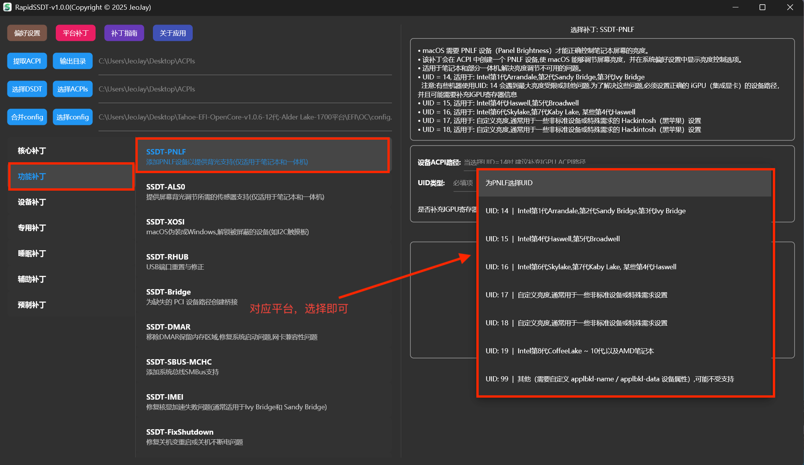

## 亮度补丁

- [1.直接提取本机DSDT、SSDT,给当前正在使用的电脑制作亮度补丁](#1直接提取本机DSDT、SSDT,给当前正在使用的电脑制作亮度补丁)

- [2.非本机DSDT、SSDT,给他人已经提取好的DSDT、SSDT制作亮度补丁](#2非本机DSDT、SSDT,给他人已经提取好的DSDT、SSDT制作亮度补丁)

### 1.直接提取本机DSDT、SSDT,给当前正在使用的电脑制作亮度补丁

简要步骤(以下仅为演示，忽略图中12代硬件配置，实际操作请根据自己的情况进行配置):

【提取ACPI】-> 【功能补丁】-> 【SSDT-PNLF】-> 【选择UID类型】 ->【执行补丁】->【选择config】->【合并config】

   【提取ACPI】:

  

   【功能补丁】-> 【SSDT-PNLF】-> 【选择UID类型】->【执行补丁】 :

  

  【选择config】:

  

  【合并config】:

  

### 2.非本机DSDT、SSDT,给他人已经提取好的DSDT、SSDT制作亮度补丁

简要步骤:

【选择ACPIs】-> 【功能补丁】-> 【SSDT-PNLF】-> 【选择UID类型】 ->【执行补丁】->【选择config】->【合并config】

   【选择ACPIs】:
   
   

  后面操作与 [1.直接提取本机DSDT、SSDT,给当前正在使用的电脑制作亮度补丁](#1直接提取本机DSDT、SSDT,给当前正在使用的电脑制作亮度补丁)相同,不再赘述！！！