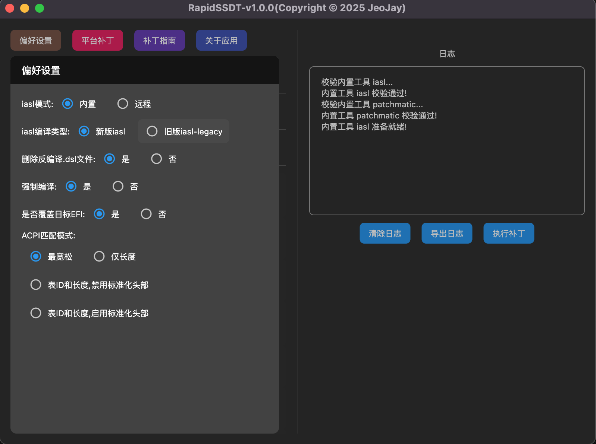

## 偏好设置

偏好设置，这里的功能选项通常保持默认即可

#### 1.1 iasl模式:

内置: 使用内置iasl工具编译SSDT(无需下载，无需网络，离线可用，推荐使用)

远程: 先下载远程仓库iasl相关工具,然后使用下载的工具编译SSDT(需要网络下载，下载后离线可用，几乎用不到，属于保留功能)

#### 1.2 iasl编译类型:

新版iasl: 使用现代iasl工具编译SSDT,兼容最新的ACPI规范。

旧版iasl-legacy: 使用传统iasl-legacy工具编译SSDT,仅兼容旧版ACPI规范，仅支持macOS 10.6及更早版本，属于保留功能，不建议使用！

#### 1.3 删除反编译.dsl文件:

是: 生成编译好的.aml文件后，删除中间.dsl文件。

否: 保留原始的.dsl文件,不删除。

#### 1.4 强制编译:

是: 忽略编译过程中某些非致命错误和警告，确保.aml编译完成。

否: 编译时严格按照ACPI规范进行，若发现不符合规范的地方，编译将失败，不会生成.aml文件。

#### 1.5 是否覆盖目标EFI:

是: 合并config时,直接将所有SSDT及补丁覆盖到目标EFI目录中(提供一个config.plist原始备份)。

否: 合并config时,只在原始补丁Results目录下，生成新的config.plist文件，需要手动合并到目标EFI目录中。

#### 1.6 ACPI匹配模式:

略，通常保持默认即可。

