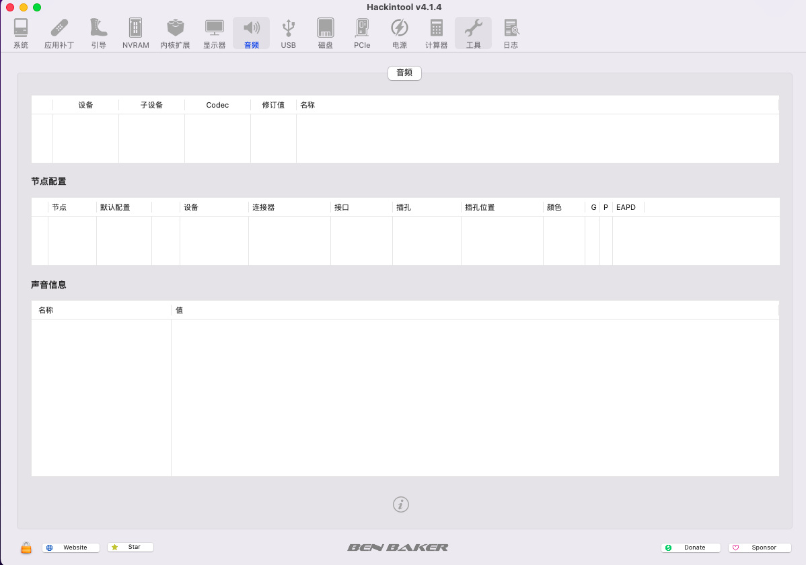
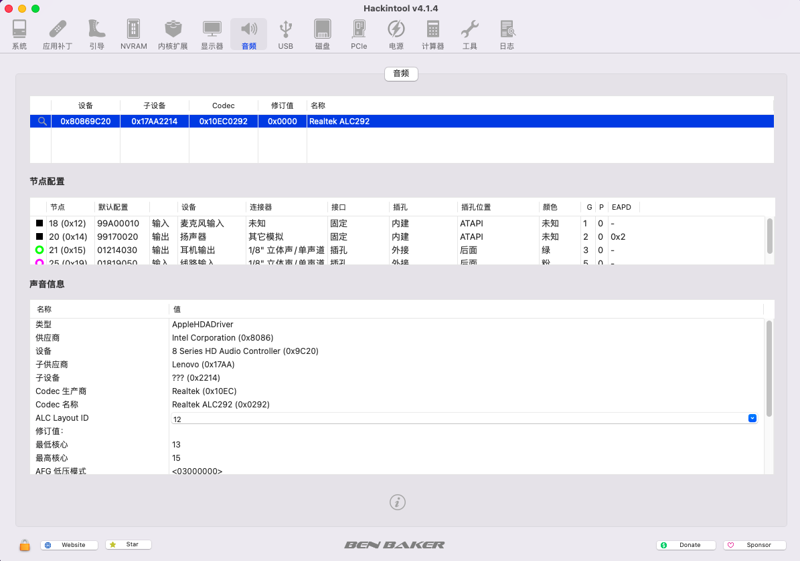
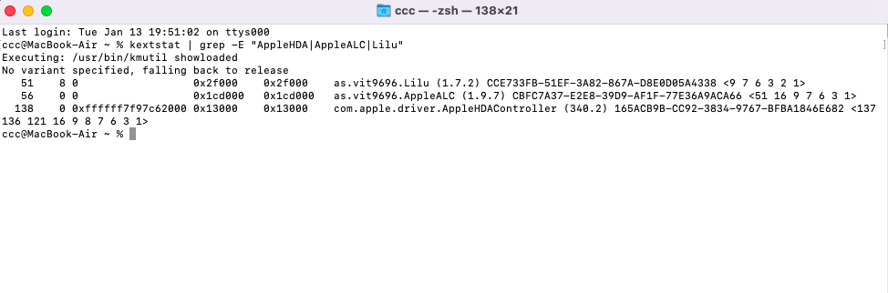
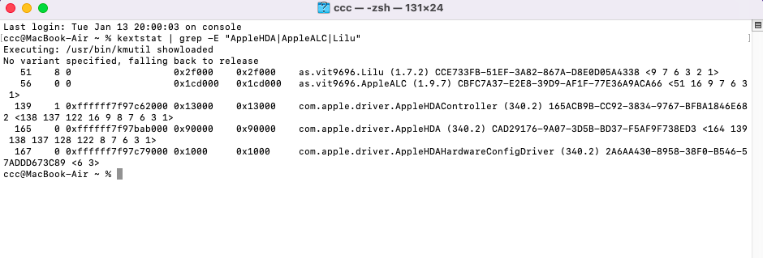
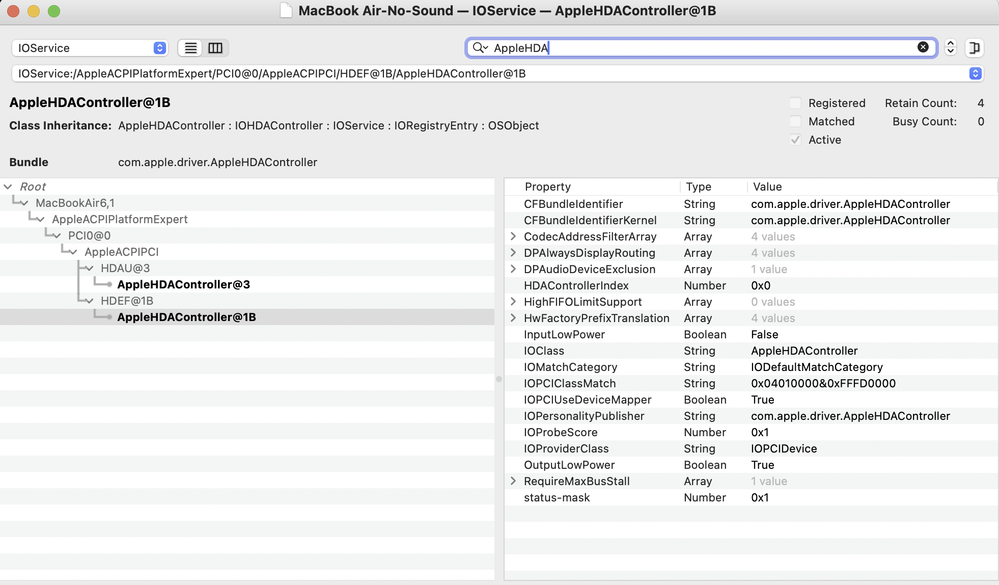
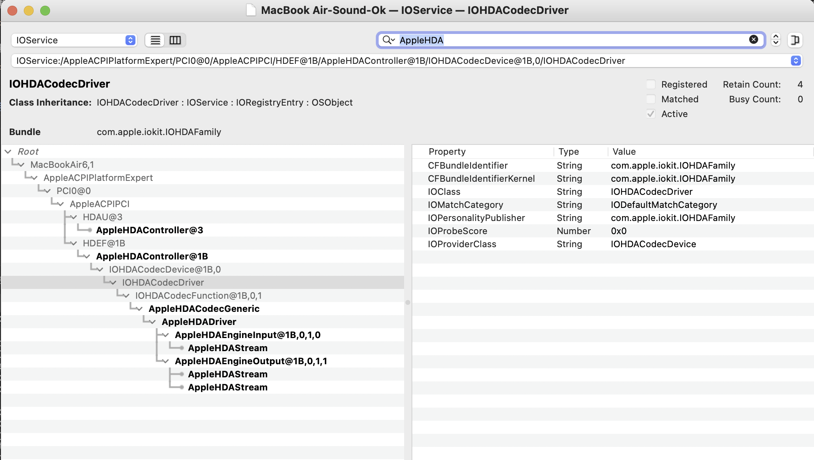
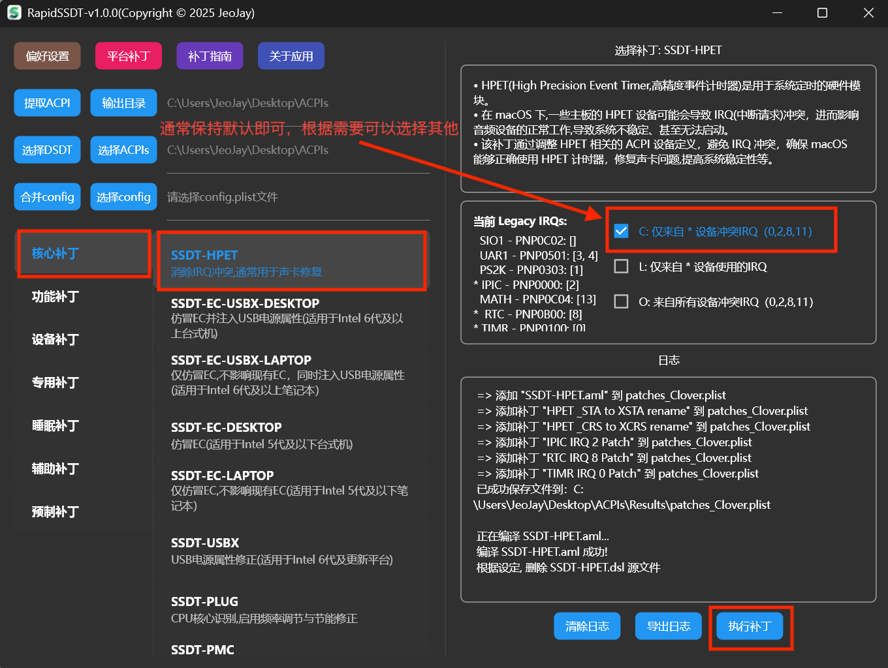

# SSDT-HPET 声卡补丁

**注意：针对的是 AppleALC(主要依赖macOS AppleHDA) 驱动，万能声卡 VoodooHDA 驱动不适用，请务必删除或者卸载 VoodooHDA 驱动！！！**


- [1.确定是否存在声卡IRQ冲突问题](#1确定是否存在声卡IRQ冲突问题)

- [1.1 macOS Tahoe 26 声卡IRQ补丁](#1.1-macOS-Tahoe-26-声卡IRQ补丁)

- [1.2 macOS Sequoia 15及以下版本声卡IRQ补丁](#1.2-macOS-Sequoia-15及以下版本声卡IRQ补丁)

- [1.2.1 使用hackintool工具查询(不一定准确)](#1.2.1-使用hackintool工具查询(不一定准确))

- [1.2.2 使用系统终端工具查询(准确)](#1.2.2-使用系统终端工具查询(准确))

- [1.2.3 使用IORegistryExplorer工具查询(准确)](#1.2.3-使用IORegistryExplorer工具查询(准确))

- [2.制作SSDT-HPET补丁](#2制作SSDT-HPET补丁)

- [2.1 直接提取本机DSDT、SSDT,给当前正在使用的电脑制作SSDT-HPET补丁](#2.1-直接提取本机DSDT、SSDT,给当前正在使用的电脑制作SSDT-HPET补丁)

- [2.2 非本机DSDT、SSDT,给他人已经提取好的DSDT、SSDT制作SSDT-HPET补丁](#2.2-非本机DSDT、SSDT,给他人已经提取好的DSDT、SSDT制作SSDT-HPET补丁)


## 1.确定是否存在声卡IRQ冲突问题

部分平台使用AppleALC (主要依赖macOS AppleHDA)驱动声卡,即使使用了正确的layout-id,但仍可能存在IRQ冲突问题,导致声卡无法正常工作.
RapidSSDT 提供了声卡IRQ补丁功能,主要用于解决声卡IRQ冲突问题.

### 1.1 macOS Tahoe 26 声卡IRQ补丁
请注意,**由于苹果官方从macOS Tahoe 26 Beta2 开始,移除了系统 AppleHDA 驱动，因此在macOS Tahoe 26 Beta 2及以上版本**,**需要先使用OCLP给系统打音频补丁(安装AppleHDA驱动)**,然后参照 [1.2 macOS Sequoia 15及以下版本声卡IRQ补丁](#1.2-macOS-Sequoia-15及以下版本声卡IRQ补丁) 进行配置.

### 1.2 macOS Sequoia 15及以下版本声卡IRQ补丁

**重要:已经按照指南,根据自己的声卡型号,正确注入了合适的声卡ID(就是任意一个官方支持列表中的ID) (推荐使用启动参数 alcid=xx) ！！！**

##### 1.2.1 使用hackintool工具查询(不一定准确)

查询前，确保EFI引导加载了AppleALC.kext驱动。以下是hackintool工具查询，看不到声卡(大概率存在声卡IRQ冲突问题),需要制作SSDT-HPET补丁



以下是hackintool工具查询，可以看到声卡(不存在声卡IRQ冲突问题),不需要制作SSDT-HPET补丁:



注意:如果hackintool工具查询,可以看到声卡,表示不存在声卡IRQ冲突问题,但是ID不一定适合(可能存在部分bug).可以根据自己的声卡型号,从官方支持列表中,一个个选择尝试,直到找到一个合适的ID.


##### 1.2.2 使用系统终端工具查询(准确,推荐)

打开终端工具，输入以下命令，查询当前系统AppleHDA及相关驱动加载情况：

```bash
sudo kextstat | grep -E "AppleHDA|AppleALC|Lilu"
```

如果是以下结果，能够看到AppleALC驱动已加载,但是看不到AppleHDA驱动加载,表示存在声卡IRQ冲突问题,需要制作SSDT-HPET补丁.



如果是以下结果,可以看到AppleALC,AppleHDA相关驱动都已加载,不存在声卡IRQ冲突问题,不需要制作SSDT-HPET补丁.




##### 1.2.3 使用IORegistryExplorer工具查询(准确)

打开IORegistryExplorer工具,搜索查询AppleHDA(**使用前确保EFI引导加载了AppleALC.kext驱动**)

IORegistryExplorer 工具查询,完全看不到AppleHDACodec相关,存在IRQ冲突问题,需要制作SSDT-HPET补丁.



IORegistryExplorer 工具查询,可以看到AppleHDACodec,不存在IRQ冲突问题,不需要制作SSDT-HPET补丁.




## 2.制作SSDT-HPET补丁

 RapidSSDT 制作SSDT-HPET补丁流程:

 #### 2.1 直接提取本机DSDT、SSDT,给当前正在使用的电脑制作SSDT-HPET补丁

【提取ACPI】-> 【核心补丁 - 选择SSDT-HPET】->【执行补丁】->【选择config】->【合并config】

  【提取ACPI】:

  

  【核心补丁】->【SSDT-HPET】:

  

  【选择config】:

  

  【合并config】:

  

 #### 2.2 非本机DSDT、SSDT,给他人已经提取好的DSDT、SSDT制作SSDT-HPET补丁

   简要步骤: 【选择ACPIs】或者【选择DSDT】-> 【核心补丁 - 选择SSDT-HPET】->【执行补丁】->【选择config】->【合并config】

   与2.1基本相同,只是【选择ACPIs】或者【选择DSDT】这一步,需要选择他人已经提取好的DSDT、SSDT所在文件夹(或者DSDT文件)

   【选择ACPIs】:
   
   

  后面操作与 2.1相同,不再赘述！！！

