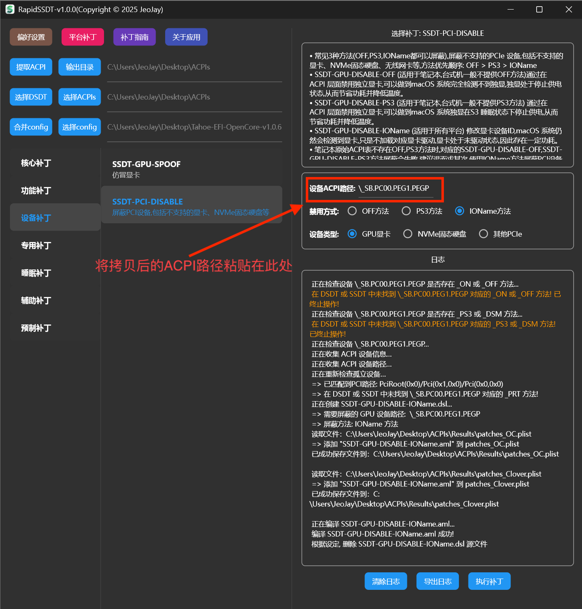
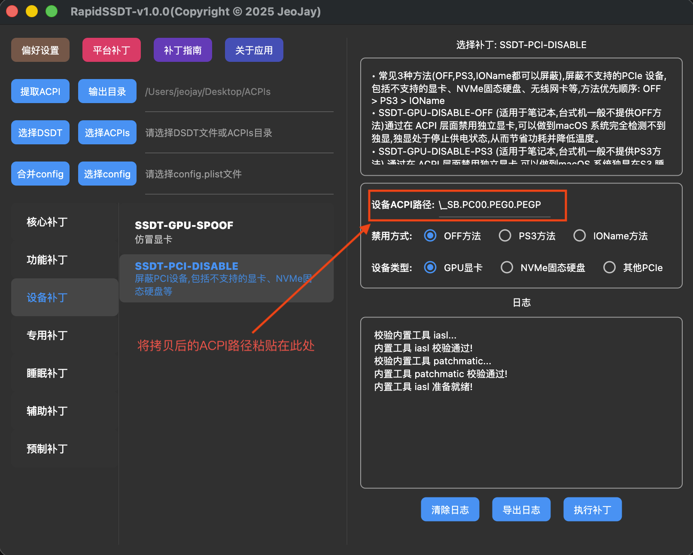

## 屏蔽设备

 - [1.精准屏蔽设备](#1-精准屏蔽设备)

 - [2.通用屏蔽设备](#2-通用屏蔽设备)

### 1. 精准屏蔽设备

屏蔽设备,**并非一定需要DSDT,SSDT表,只是强烈推荐这样做。** 因为如果提供了DSDT,SSDT表,**RapidSSDT工具会分析提供的设备路径是否存在,以及相关依赖的方法是否存在(特别是:_OFF方法,_PS3方法),如果不存在,则屏蔽补丁会失效。** 这样制作出来的屏蔽补丁相对精准可靠.

- 常见3种方法(OFF,PS3,IOName都可以屏蔽),屏蔽不支持的PCIe 设备,包括不支持的显卡、NVMe固态硬盘、无线网卡等,方法优先顺序: OFF > PS3 > IOName

- SSDT-GPU-DISABLE-OFF (适用于笔记本,台式机一般不提供OFF方法)通过在 ACPI 层面禁用独立显卡,可以做到macOS 系统完全检测不到独显,独显处于停止供电状态,从而节省功耗并降低温度。

- SSDT-GPU-DISABLE-PS3 (适用于笔记本,台式机一般不提供PS3方法) 通过在 ACPI 层面禁用独立显卡,可以做到macOS 系统独显在S3 睡眠状态下停止供电,从而节省功耗并降低温度。

- SSDT-GPU-DISABLE-IOName (适用于所有平台) 修改显卡设备ID,macOS 系统仍然会检测到显卡,只是不加载对应显卡驱动,显卡处于未驱动状态,因此存在一定功耗。

- 笔记本原始ACPI表不存在OFF,PS3方法时,对应的SSDT-GPU-DISABLE-OFF,SSDT-GPU-DISABLE-PS3方法屏蔽会失败,建议退而求其次,使用IOName方法屏蔽PCI设备

 #### 1.1 直接提取本机DSDT、SSDT,给当前正在使用的电脑制作屏蔽补丁

 简要步骤:

【提取ACPI】-> 【设备补丁】-> 【SSDT-PCI-DISABLE】-> 【填写ACPI路径】-> 【选择屏蔽方法和设备类型】 ->【执行补丁】->【选择config】->【合并config】

  【提取ACPI】:

  

  【设备补丁】-> 【SSDT-PCI-DISABLE】:

   获取ACPI路径(可以通过RapidEFI详细配置，点击拷贝即可):

  

  

  【选择config】:

  

  【合并config】:

  

 #### 1.2 非本机DSDT、SSDT,给他人已经提取好的DSDT、SSDT制作屏蔽补丁

简要步骤:

【选择ACPIs】-> 【设备补丁】-> 【SSDT-PCI-DISABLE】-> 【填写ACPI路径】-> 【选择屏蔽方法和设备类型】 ->【执行补丁】->【选择config】->【合并config】

   【选择ACPIs】:

   

  后面操作与[1.1 直接提取本机DSDT、SSDT,给当前正在使用的电脑制作屏蔽补丁](#1-1-直接提取本机DSDT、SSDT,给当前正在使用的电脑制作屏蔽补丁)相同,不再赘述！！！

### 2. 通用屏蔽设备

   此种方式不依赖DSDT,SSDT表,只需要提供需要屏蔽设备的ACPI路径即可,**制作通用的屏蔽补丁,不一定有效**(特别是OFF,PS3方法)。通用屏蔽设备,优先推荐IOName方法。

  简要步骤:

  【设备补丁】-> 【SSDT-PCI-DISABLE】-> 【填写ACPI路径】-> 【选择屏蔽方法和设备类型】 ->【执行补丁】->【选择config】->【合并config】

  【设备补丁】-> 【SSDT-PCI-DISABLE】:

   获取ACPI路径(可以通过RapidEFI详细配置，点击拷贝即可):

  

  

  【选择config】:

  

  【合并config】:

  