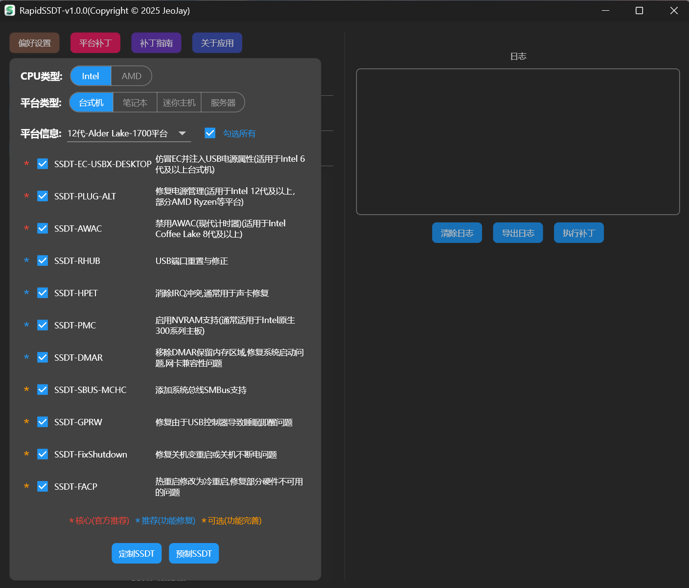
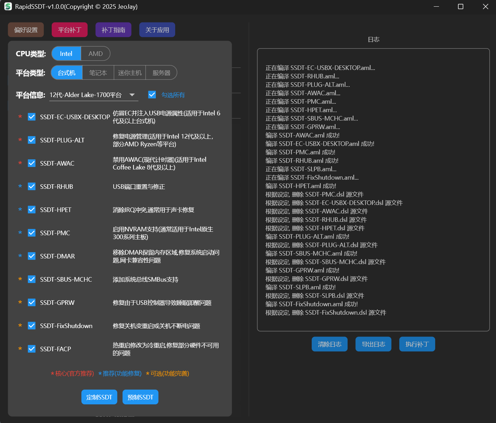
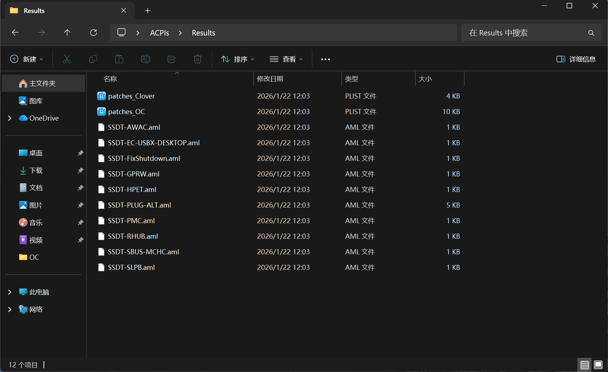
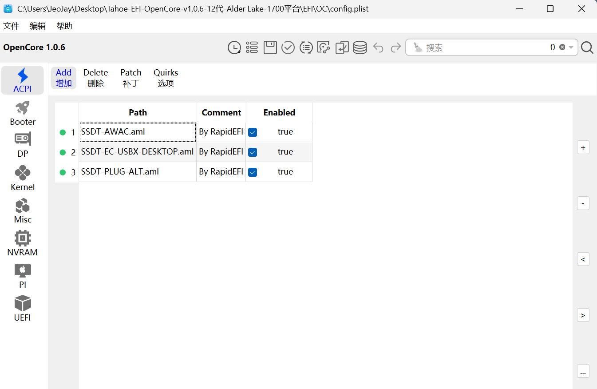
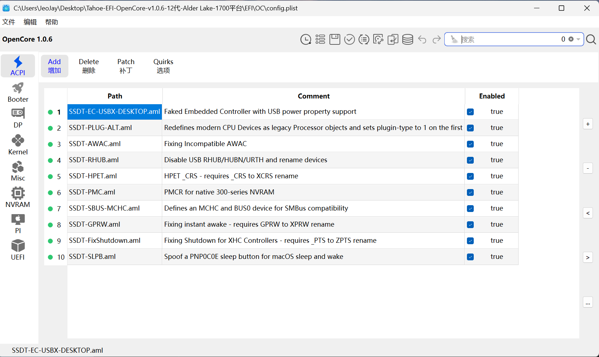
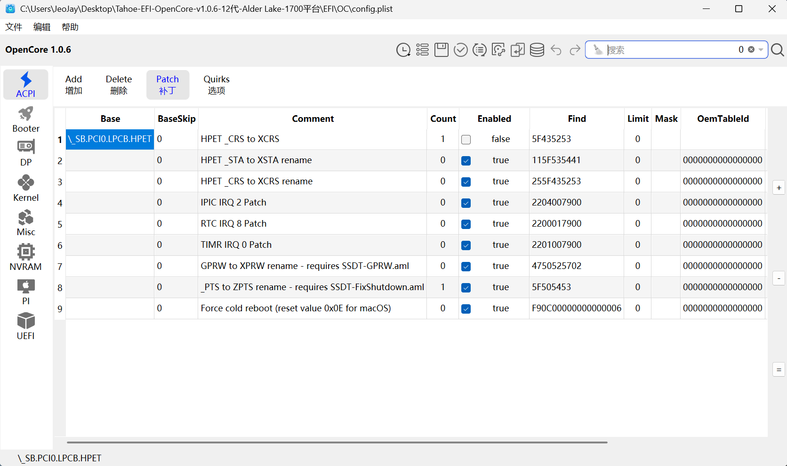

## 平台补丁

为了方便快速确定需要哪些SSDT, RapidSSDT 提供了一个平台补丁,打开后,会自动列出当前平台所需的所有SSDT(核心补丁和推荐补丁).

平台补丁主要根据CPU类型(Intel 或 AMD) , 平台类型(台式机,笔记本,迷你主机,服务器),具体平台信息(所属哪一代)来确定需要哪些SSDT.所有这些来源于官方指南: [https://dortania.github.io/Getting-Started-With-ACPI/ssdt-platform.html#desktop](https://dortania.github.io/Getting-Started-With-ACPI/ssdt-platform.html#desktop)

### 1.使用本机DSDT、SSDT

【提取ACPI】:

   

### 2.非本机DSDT、SSDT

【选择ACPIs】:

   

 **RapidSSDT 平台补丁说明:**

【核心(官方推荐)】: 强制选择，不允许修改

【推荐(功能修复)】: 允许修改,建议选择，根据实际情况选择是否使用

【可选(功能完善)】: 允许修改,根据实际情况选择是否使用

【勾选所有】: 勾选后,会自动勾选所有SSDT(核心,推荐,可选),去掉勾选后,会自动取消除了核心以外的所有SSDT(仅保留核心补丁).

【定制SSDT】: 点击后,平台补丁列表勾选的所有SSDT,会根据本机DSDT&SSDT,自动生成全部定制SSDT.一步完成！！！

【预制SSDT】: 点击后,平台补丁列表勾选的所有SSDT,不会根据本机DSDT&SSDT,只是根据官方指南,自动生成全部预制通用的SSDT(SSDT-HPET等个别除外,几乎都是非定制,存在很多冗余).一步完成！！！

 以下只是演示,一键勾选所有SSDT(核心,推荐,可选)

点击【定制SSDT】,默认在桌面ACPIs目录Results文件夹下生成SSDT及补丁

### 3. 合并SSDT及补丁

查看目标EFI合并前 SSDT

【选择config】(选择目标EFI config):

【合并config】

查看合并后的EFI SSDT

查看合并后的EFI 补丁

