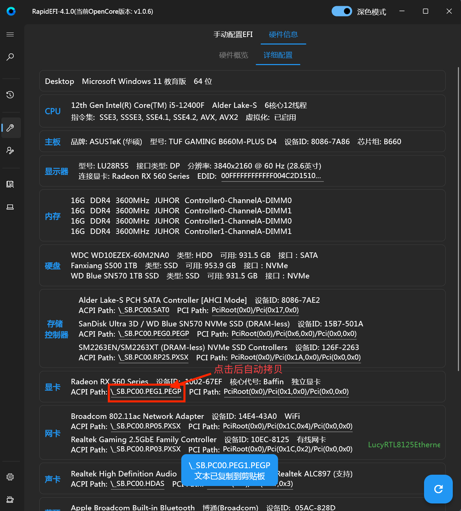
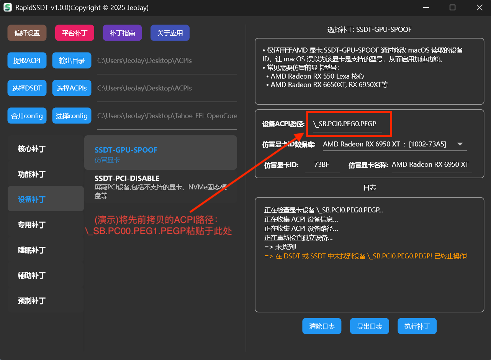
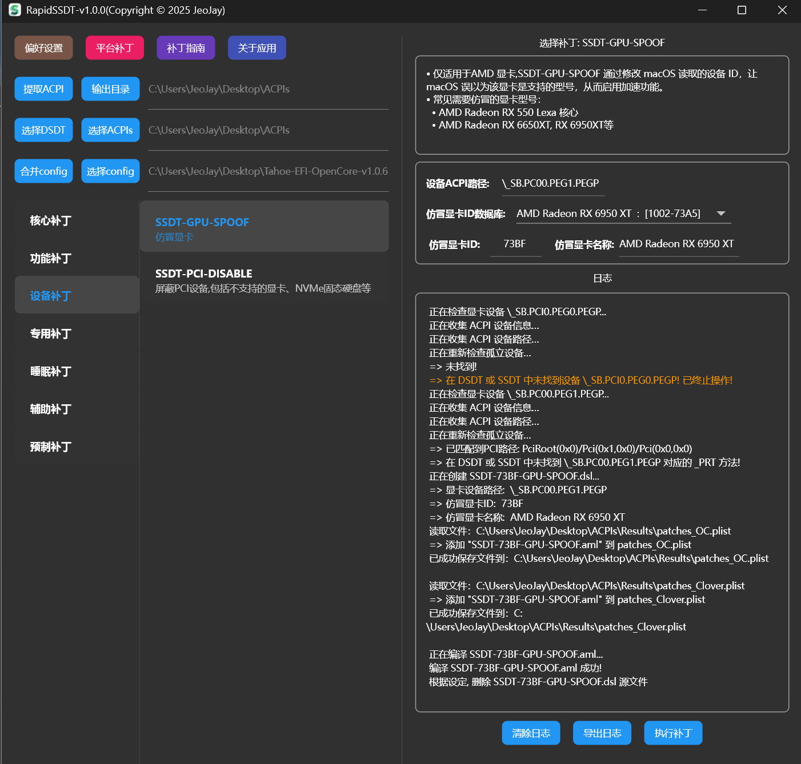
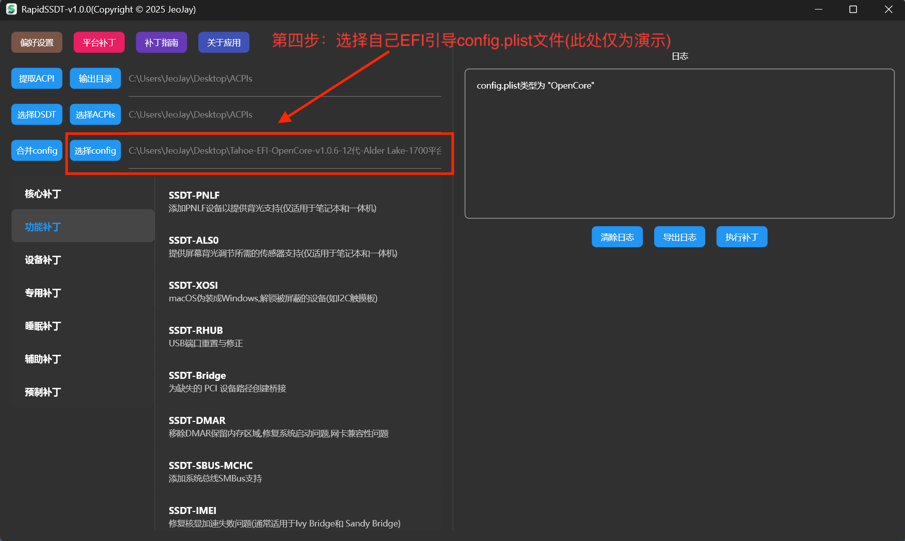
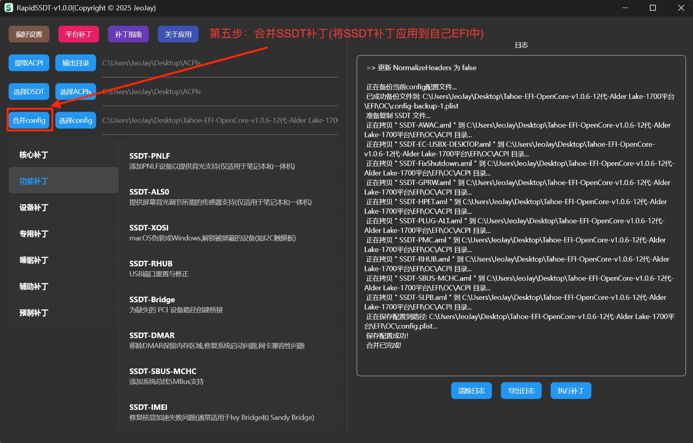
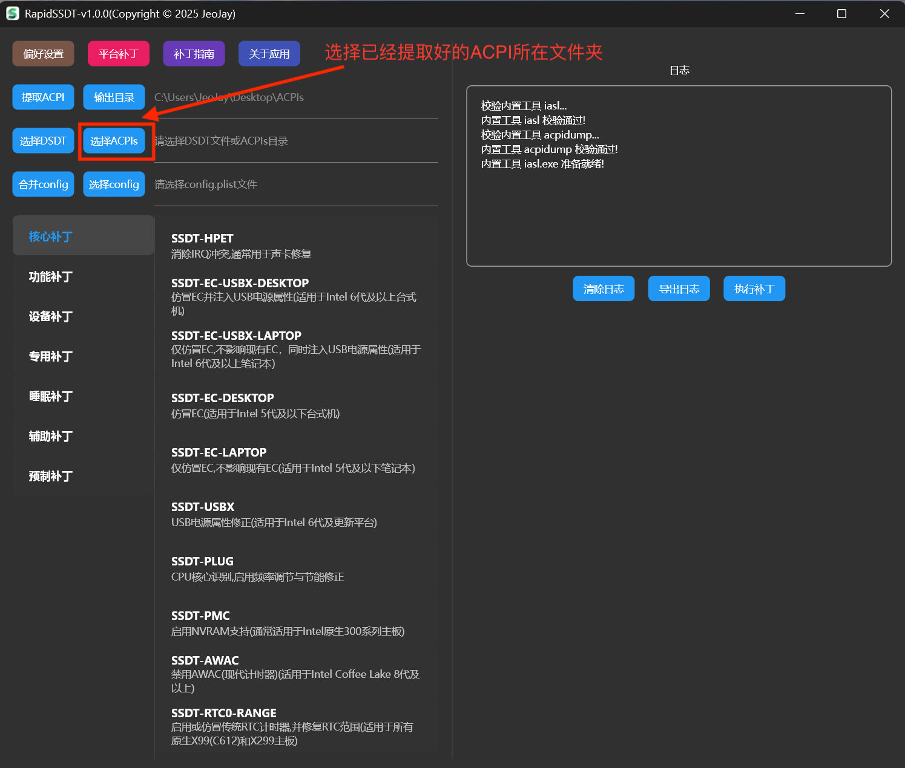
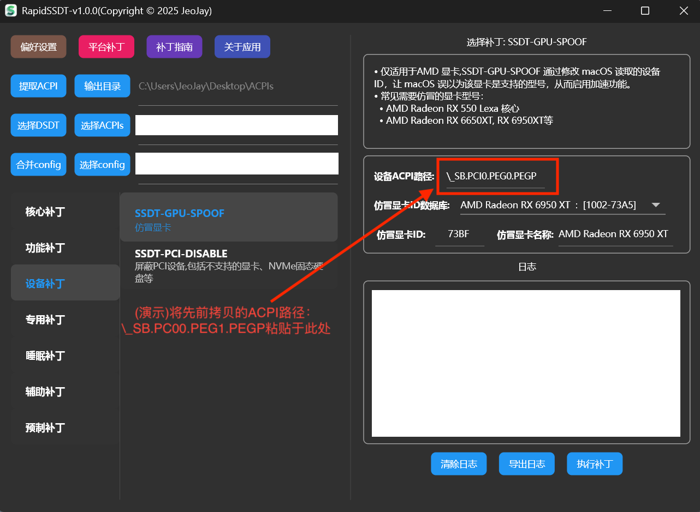

## 显卡仿冒

 - [1.精准显卡仿冒](#1-精准显卡仿冒)

 - [2.通用显卡仿冒](#2-通用显卡仿冒)

### 1. 精准显卡仿冒

仿冒设备(这里主要针对AMD独显),**并非一定需要DSDT,SSDT表,只是强烈推荐这样做。** 因为如果提供了DSDT,SSDT表,**RapidSSDT工具会分析提供的设备路径是否存在,以及是否需要注入桥接设备(很多仿冒失败的原因就在于此),如果不存在,则仿冒时自动注入桥接设备，确保仿冒成功。** 这样制作出来的仿冒补丁相对精准可靠.

 #### 1.1 直接提取本机DSDT、SSDT,给当前正在使用的电脑制作仿冒补丁

 简要步骤:

【提取ACPI】-> 【设备补丁】-> 【SSDT-GPU-SPOOF】-> 【填写ACPI路径】-> 【填写仿冒ID】 ->【执行补丁】->【选择config】->【合并config】

  【提取ACPI】:

  

  【设备补丁】-> 【SSDT-GPU-SPOOF】:

获取ACPI路径(可以通过RapidEFI详细配置，点击拷贝即可):

  

需要说明的是: 工具提供了一个仿冒显卡ID数据库, 数据库中包含了一些常见的需要仿冒的显卡ID,如果你的显卡ID不在数据库中,但确定需要仿冒,可以手动填写仿冒ID即可.(未包含的需要仿冒的显卡型号及ID,可以联系作者补充,黑果社区感谢你的一份贡献!)

  

  

  【选择config】:

  

  【合并config】:

  

  

 #### 1.2 非本机DSDT、SSDT,给他人已经提取好的DSDT、SSDT制作仿冒补丁

简要步骤:

【选择ACPIs】-> 【设备补丁】-> 【SSDT-GPU-SPOOF】-> 【填写ACPI路径】-> 【填写仿冒ID】 ->【执行补丁】->【选择config】->【合并config】

   【选择ACPIs】:

   

  后面操作与[1.1 直接提取本机DSDT、SSDT,给当前正在使用的电脑制作仿冒补丁](#1-1-直接提取本机DSDT、SSDT,给当前正在使用的电脑制作仿冒补丁)相同,不再赘述！！！

### 2. 通用显卡仿冒

   此种方式不依赖DSDT,SSDT表,只需要提供显卡ACPI路径即可,**制作通用的显卡仿冒补丁,不一定有效**(特别是隐藏真实显卡设备的情况,有技术的可以使用SSDT补一个桥接设备即可)。

  简要步骤:

  【设备补丁】-> 【SSDT-GPU-SPOOF】-> 【填写ACPI路径】-> 【填写仿冒ID】 ->【执行补丁】->【选择config】->【合并config】

  【设备补丁】-> 【SSDT-GPU-SPOOF】:

   获取ACPI路径(可以通过RapidEFI详细配置，点击拷贝即可):

  

  需要说明的是: 工具提供了一个仿冒显卡ID数据库, 数据库中包含了一些常见的需要仿冒的显卡ID,如果你的显卡ID不在数据库中,但确定需要仿冒,可以手动填写仿冒ID即可.(未包含的需要仿冒的显卡型号及ID,可以联系作者补充,黑果社区感谢你的一份贡献!)

  

  【选择config】:
  
  

  【合并config】:

  
