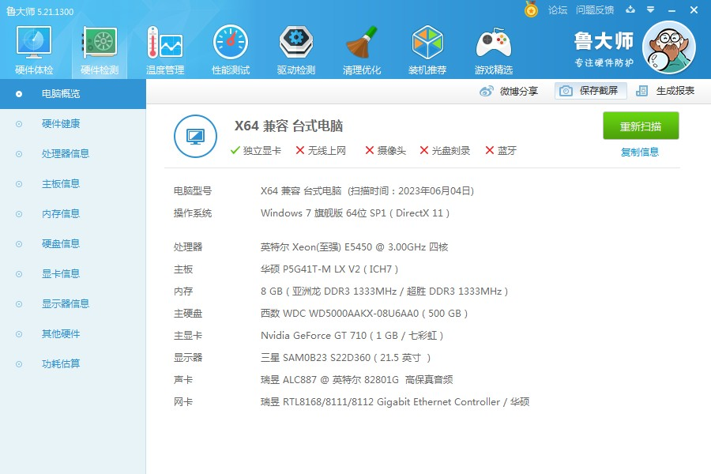
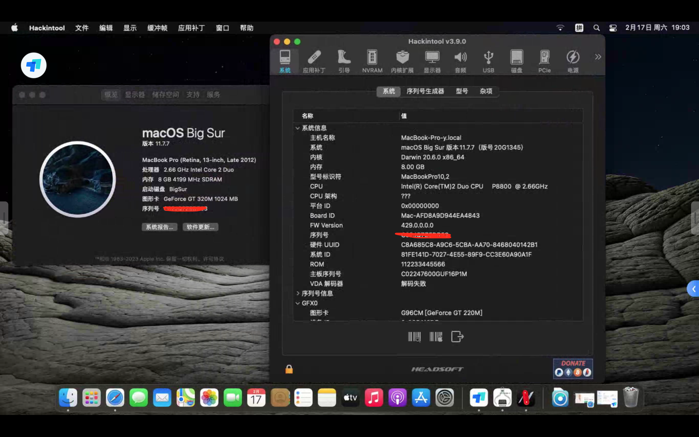
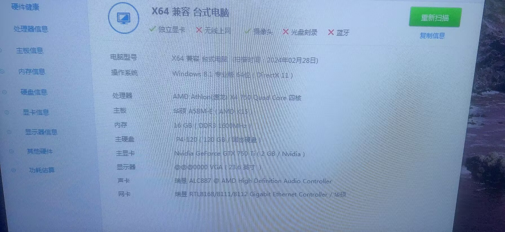
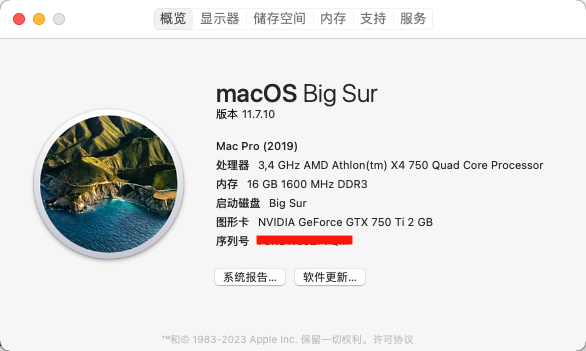
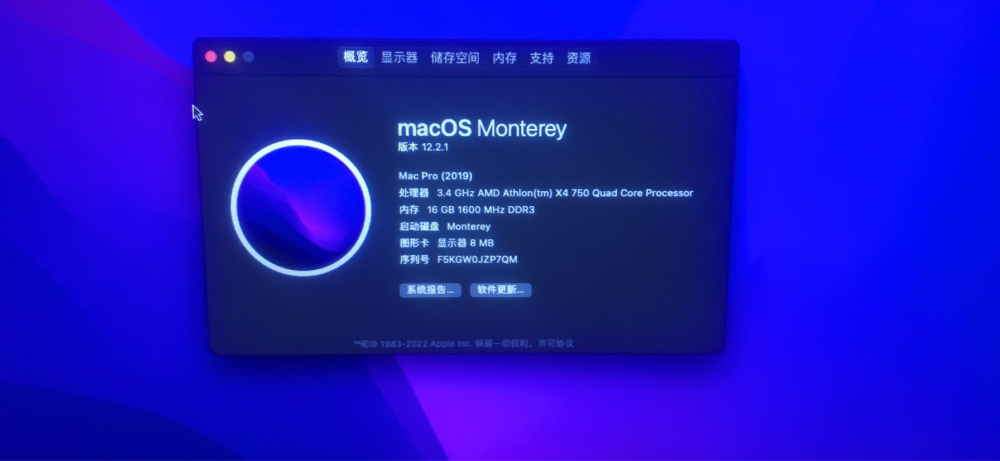
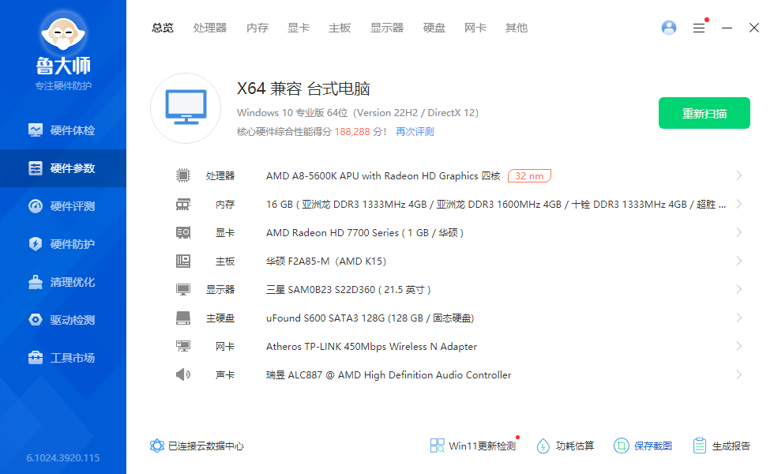

## 使用RapidEFI成功案例(部分展示)

## 注意0代(775平台) ~  3代老平台使用的Pro版配置的EFI,后面不再赘述！

## Intel平台

### 台式机

### 0代Intel-775平台：

- 华硕P5G41T-M LX V2 + E5450 + GT710 (macOS Sonoma 14) (来自作者)
  
  支持macOS 10.11.6 ~ macOS Sonoma 14.x

- 技嘉P41T-D3 + E5450 + GTX1050 (macOS Montery 12.6) (来自网友)

- 华硕P5G41T-M LX V3 + Q8400 + GT640 (macOS Ventuta 13.6) (来自网友)

### 1代H55平台 (来自网友)

- 英特尔H55 + i5-750-HD7750 (macOS Ventura 13.6)

- 技嘉 H55M-D2H + x3440 + HD7850 (macOS Ventura 13.4)

- 华擎 H55M-Pro + x3470 + GT 740 (macOS Sonoma 14.3)

#### 2代H61平台：

- 昂达H61M + 奔腾G645 + HD7750 （来自作者）

- 七彩虹C.H61HD + E3-1225v2 + RX470 (macOS Sonoma 14.3) (来自网友)

#### 3代平台:

- 映泰TH67A+ + E3-1245V2 + HD P4000核显 （来自作者）

- 捷波-H77 + i7-3770s + Rx460 (macOS Sonoma 14.4.1) (来自网友)

- 技嘉B75-D3V + E3-1230V2 + RX580 (macOS Sonoma 14.4.1) (来自网友)

- 戴尔Dell-H77 + E3-1230V2 + HD7770 (macOS Ventura 13.6) (来自网友)
 
- 技嘉H77-DS3H + i5-3470 + RX470 (macOS Ventura 13.6) (来自网友)

#### 4代平台(来自群友)：

- 惠普 H81 + 奔腾G3260 + GT 605

- 惠普 H81 + i3-4330 + HD4600

- 技嘉H81M-S1 + E3-1230v3 + RX580 (macOS Sonoma 14.4.1)

- 华硕B85M-F-Plus + i7-4790 + RX570 (macOS Sonoma 14.4.1)

- 技嘉Z97-N-WiFi + i7-4790K + GT740 (macOS Ventura 13.x)

#### 6代平台(来自网友):

- 微星B150M-ICAFE（魔改bios）+ E3-1220 V5 + HD7750 

#### 7代平台 (来自网友):

- 微星B250M + i5-7400 + RX580

- 七彩虹B250M-E-PRO + i5-7400 + HD630

- 技嘉B250M-D3V + i5-7500

#### 8代平台(来自群友)：

- 微星MSI-B365M-Pro-VH + i7-8700 + RX580

- 微星MSI-B365M + 魔改es qtj2

- Dell OptiPlex + i7-8700 + UHD630

#### 9代平台 （来自网友）

- 联想m920x + Q370 + 9900t 

- 联想m920q

#### 10代平台 (来自群友)

- 微星MSI-MAG-B560M迫击炮 + i5-10400 + UHD630

- 华硕TUF-GAMING-B560M-PLUS + i5-10400F + RX560

#### 12代平台 

- 华硕ASUS-B660M-PLUS + i5-12400F + RX560 (来自作者)

- 微星MSI-B660M迫击炮 + i7-12700K + RX6600XT (来自群友)

#### 13代平台：

- 铭瑄Z790m + i5-13600KF + RX6800XT (来自群友)

#### 14代平台：

- 华硕B760-Plus D5 + i7-14700KF + RX560 (macOS Sonoma 14.4) (来自群友)

### 服务器

### 第1代服务器X58平台 (来自群友)

- 华硕P6T-SE + X5650 + RX580 (macOS Sonoma 14.1) 

- 微星 MSI x58 Pro-E + X5680 + RX470 (macOS Sonoma 14.3)

- 国硕 X58-GuoShuo(ICH10) + X5660 + RX470 (macOS Sonoma 13.6)

- 科脑 X58 + X5670 + HD7770 (macOS Sonoma 14.1)

- 华硕 ASUS-P5X58D-E + X5680 + GTX760 (macOS Sonoma 13.6)

- 双路 超微 X8T6 + X5650 x2 + RX580 (macOS Sonoma 14.3)

### 第3代服务器X79平台 

- 单路 寨板X79 (H61) + E5-2630v2 + HD7850 (macOS Montery 12.6.8)

- 双路 X79 浪潮英信SA5212H2 + E5-2450 x2 + RX580 (macOS Monterey 12.6.8)

### 第4代服务器X99平台 (来自群友)

- 巨械师 MACHINIST X99Z (V102A) + E5-2680V3 + RX 560 

- 华南 X99-TF + E5-2696V3 + RX 580 (macOS Sonoma 14.x)

- 科脑双路主板 + E5-2690V4 x 2 + RX 590  (macOS Sonoma 14.3)

### 第5代服务器X99平台 

- 技嘉 X99 UD4 + E5-2682V4 + RX 5500XT

### 笔记本

#### 0代酷睿 

- Core 2双核P8800 + GT320M 老笔记本【ASUS-K40ID】

OpenCore-v0.9.8 模拟UEFI 安装macOS BigSur 11.7.7
理论支持macOS Sonoma 14.x (配置比较老，群友也不想折腾更高版本了)

#### 1代平台

- Aspire 3820ZG-i5-480M-HD5470M (来自作者)

#### 2代平台 (来自群友)

- Lenovo-Z470 + i5-2450M + HD3000

- Lenovo-G470 + i3-2310M + HD3000

- 宏基 Aspire E1-471G + i3-2310M + HD3000

#### 3代平台 (来自群友)

- 华硕X550VC + i5-3230M + HD4000 

- 联想E431 + i3-3110M + HD4000

#### 4代平台 (来自群友)

- Lenovo-X240 + i5-4200U + HD4400

#### 5代平台 (来自群友)

- 惠普tpn-c125 + i7-5500U + HD5500

- Lenovo-X250 + i5-5200U + HD5500

#### 6代平台 (来自群友)

- 联想Thinkpad X1 2016

#### 7代平台 (来自群友)

- 联想-E470C

- 联想-T480s

#### 8代平台 (来自群友)

- 戴尔 Dell Inspiron 5488 + i5-8265U

## AMD平台

### 台式机

#### 速龙老平台：

- AMD FM2平台 华硕ASUS-A58-E-X4-750-GTX750Ti (来自群友)

- AMD FM2平台 华硕ASUS-F2A85M + A8-5600K + 独显HD7750 (来自作者)

 速龙X4 730，X4 760等都是支持的

 macOS Monterey 12.7

 macOS Sonoma 14.0

### AMD Ryzen锐龙 (来自群友)

- 1.华硕ASUS-B450m + AMD 5700X + RX6700

- 2.微星MSI-B450m 迫击炮 + AMD R5 3600X + 6700XT

- 3.微星MSI-B450m + AMD R5 3600 + RX6650XT

- 4.联想ThinkCentre M75q Gen 2 + AMD R5 5600G

- 5.华擎B550 +  AMD R7 3700X + 6600XT 

- 6.华硕PRIME A320M-K + AMD R3 2200G + Vega 8 核显

### 笔记本 Ryzen锐龙 

- 1.联想小新笔记本 + AMD R7 4800U (来自群友)

- 2.宏碁Acer Swift X41G + AMD R5 5600U (来自群友)

- 3.联想昭阳E5-ABA + R5-5625U (来自网友)

- 4.联想小新 Pro 14 + AMD R7 5800H (来自网友)

### 以下是部分群友自行折腾记录(挺佩服的)

